import PasswordGuard from "../../components/PasswordGuard.jsx";

<PasswordGuard>

`                                          `

**Overview**

In summary, Zimble is the go-to solution for businesses seeking a reliable and efficient way to integrate and manage their e-commerce data. By connecting ERP and E-commerce systems and offering customization options, Zimble helps businesses stay competitive and responsive in the dynamic world of online commerce.

\
\
\
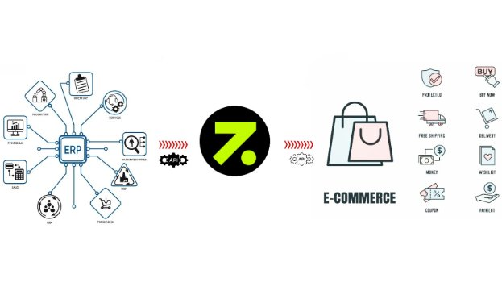

**Benefits of Zimble Integration**

\
**Here are the benefits of Zimble Integrations:**

**1. Enhanced Data Sharing: -**

Zimble Integrations enable smooth data sharing between the Zimble app and E-commerce platforms such as **Apparel21, Lightspeed, Magento to Big Commerce, Shopify**, and more. This ensures vital information is accessible where it matters, boosting effectiveness and facilitating well-informed decision-making.

**2.Streamlined Workflows: -**

By connecting the Zimble application with ERP and E-COM, integrations create streamlined workflows. This minimizes the need for manual data entry and reduces the chances of errors, ultimately saving time and effort.

**3.Real-Time Data Accessibility: -**

One of the key advantages of integration is the ability to access real-time data seamlessly across interconnected applications. This functionality allows for instantaneous updates and changes made within the ERP system. For instance, jobs such as product and stock management, order processing, and more can be scheduled through Zimble. Once these jobs are completed, the updates are automatically reflected in the associated e-commerce platforms such as Shopify, Big Commerce, and others.

**4.Increased Productivity: -**

With Zimble Integrations, users can stay within their familiar application environment while still benefiting from the capabilities of other software. This leads to increased productivity as users don't have to switch between multiple platforms to perform tasks.

We have four instances of zimble. They are:

[QA App](https://qa-app.zimble.io/)

[Stage App](https://stage-app.zimble.io/)

[Production App](https://app.zimble.io/)

[AGH App](https://agh.app.zimble.io/)

**Login Functionality**

**Zimble Login Process:**

As soon as we open the zimble site, we will see a login page where we need to enter our email and password to login successfully.

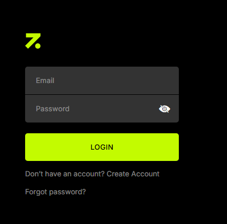

**Forgot Password Process:**

Navigate to Login Page:

When the user forgets their password, they go to the login page and click on the "Forgot Password" link.

` `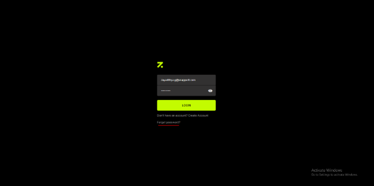

**Recovery Instructions:**

The user is then directed to a page where a message appears: "We'll send recovery instructions to your email address."

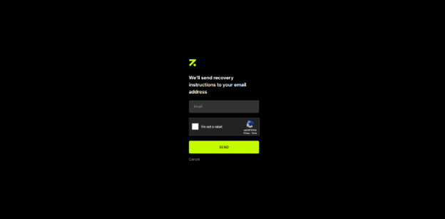 

**Email Entry and Captcha:**

The user enters their email address associated with the account. After that, they need to complete a Captcha to verify they are not a robot.

` `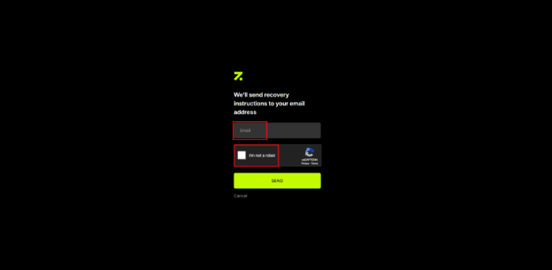

**Send Recovery Email:**

Once the email and Captcha are verified, the user clicks "Send". The system sends a recovery email to the user with a link to reset their password.

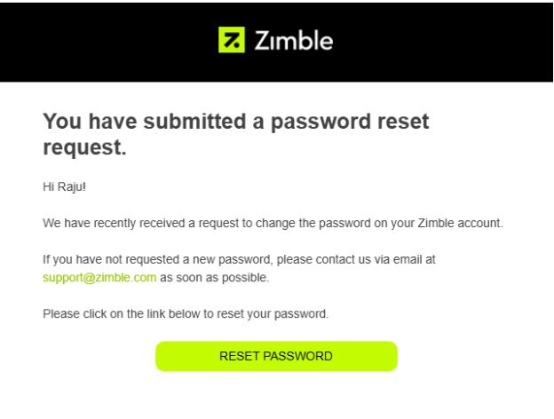 

**Password Reset Link Expiry:**

The link in the recovery email is valid for only 15 minutes. The user must reset their password within this time frame; otherwise, the link will expire.

**User Interface Overview and Functionality**

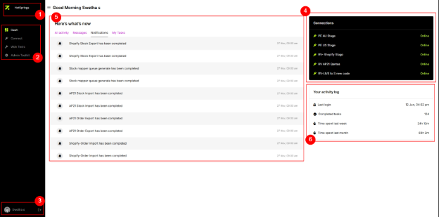

**1.Client Switch Button: -**

The "Client Switch" button is a feature designed to facilitate seamless switching between clients. This functionality allows users to transition from one client to another with ease

**2.Main Menu: -**

The main menu serves as the central hub for accessing various features and functionalities within the Zimble application.

1) **DASH-BOARD**

The dashboard functions as the initial landing page of the Zimble application. It provides users with a comprehensive overview of key metrics, data, and insights relevant to their activities.

1) **CONNECT**

The "**Connect**" section serves as a repository for managing connections between the ERP and ECOM modules. Users can configure, monitor, and maintain these vital connections from this interface.

3) **WEB TOOL**

The "**Web Tools**" section encompasses a range of utilities designed to enhance the user experience. This includes tools such as a media manager and a translator, datasets and data exchange.

3) **ADMIN TOOLKIT**

The "**Admin Toolkit**" section offers administrative capabilities crucial for managing the application. It includes features like managing warehouse locations, user accounts, roles, and rules engine.

**3.User Profile:**

The "**User Profile**" section allows users to view and manage their personal details and settings within the application.

**4. Connections:** 

Within the "**Connections**" section, users can view and interact with the connections established between the ERP and ECOM modules. This area provides insights into the status and performance of these connections.

**5. Notification box** 

It displays all completed task notifications. Several options are visible for easy navigation, including:

- All Activity
- Messages
- Notifications
- My Tasks

When you click on any of these options, the corresponding tasks for that specific category are not displayed. 

All options show messages that are categorized by the same date ATM.
# **6.Your activity log** 
This section provides an overview of how much time has been spent on Zimble and the number of completed tasks. 

Four options are visible:

- **Last Login** – Displays the last login date.
- **Completed Tasks** – currently showing the dummy data in Zimble.
- **Time Spent Last Week** – currently showing the dummy data in zimble.
- **Time Spent Last Month** – currently showing the dummy data in zimble.

The **Last Login** option gives a real date, while the remaining options are of dummy data.

\
\
\
\
\
\
\
\
\

**Overview of the Connections Page**   

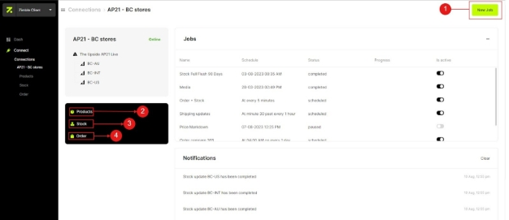

1. **New Job:**

The "**New Job**" option is used to create different types of tasks, such as updating products, managing stock, importing orders, and handling media.

\

1. **Products:**

The "**Products**" option allows you to view the updated product data that comes from the **ERP (Enterprise resource planning)** system. You can see detailed information about each product.

\

1. **Stock:**

The "**Stock**" option shows you the current stock levels for each product and its variants. This helps you keep track of your inventory.

\
\
\
\

1. **Order:**

The "**Order**" option lets you see the orders placed by customers through the front-end website. You can view order IDs, prices, payment statuses, and other important order details.

\
\
\
\
\

\
\
\
\
\
\
\
\

\
**Overview of the Job Types** 

**Dynamic Job Types and Future Scalability:**

Job types within the system are fully dynamic and designed to accommodate growth ahead. This flexibility allows the platform to adapt to evolving business requirements and new functionalities seamlessly.

For example, the system already includes specific job types such as 'Coupons Sync' and 'Persons (Customer) Sync' in AGH. As additional job types are introduced in the future, they can be easily incorporated without disrupting the existing structure.

By ensuring the dynamic nature of job types, the platform can continue to support diverse workflows and use cases, enhancing scalability and maintaining relevance as business needs expand.

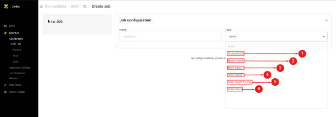

After clicking the '**New Job**' button, the following page will become visible. You will be prompted to select the job type from the dropdown menu. A list of multiple job templates will be displayed. Choose the template that aligns with your specific requirements.

There are different types of jobs created in different clients as per the client requirement.

- Product Job
- Stock Job
- Order Job
- Shipping Updates Job
- Order Compare Job
- Associate Products Job
- Warehouse Import Job
- Media Job
- Price Markdown Job

1. **Product Build: -** 

If we need to build the products in the respective E-commerce platform like Shopify, Big commerce, Etc., in that we use this Product build type. This product template works to fetch the Product data from ERP and import that data into respective E-com platform.

1. **Media: -** 

These media types are used to import the Product images or Swatches etc., through this job, before using this MEDIA Type we need to create media recipe in the media page of webtools section with the sequence. **Example:-**(SKU\_Brand\_Colour\_01)

\
\
\
\

3. **Stock: -** 

This stock template is used to update the stock for the products which are available in big commerce or shopify etc.,

3. **Order: -** 

The "**Order**" template serves to update orders originating from the front-end store. These orders are exported from the destination e-commerce stores and then integrated into Zimble. The order is updated with details such as “**order status, order number, customer name, fulfillment status”,** and more to ERP.**  

3. **Order Import AU only: -** 

The "**Order Import AU only**" template is specifically intended to retrieve order details exclusively from a designated store location. In cases where there are multiple store locations **(e.g., AU, INT, US)**, this template enables import orders from the specified location. For instance, if "**AU**" is selected, only orders from the Australian store will be imported.

3. **Order + Stock: -**

`  `The "**Order + Stock**" template combines the functionalities of both order and stock updates into a single job. This template streamlines the process of simultaneously updating both order-related information and stock levels.

**Creation of the Job**

- Jobs play an important role to perform any task in Zimble.
- To create a Job, we must navigate to connect page for the client and click on create job option available in the top right corner.

- Upon clicking on it, there is an option to choose a template when we click on the “type” dropdown to select what type of job we want to run (ex: product job, stock job, order job, etc.)

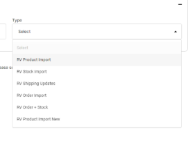

- Once we select the template, give a title for the job and schedule the time when we want to run the job, and click on the “save” button.

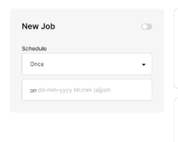

- Set the toggle to an active state before or after saving the job to run it.

4. **What does a job template mean?**
- To run a Job, we must send a command to the system about what type of job we are running and what steps are to be performed in that job.
- For example, if It is an order job, the steps in the order template would be fetching orders from the destination and 2nd step would be sending those orders into AP21.
- To do that we have to configure a job and create a template so that we can just select a template and run a job whenever necessary.

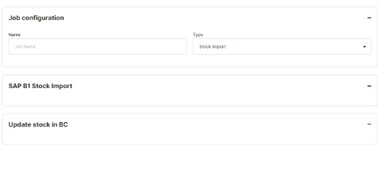

4. **How to check the status and progress of a job?**

- When we schedule a job we will be able to check the job status in the jobs list page.

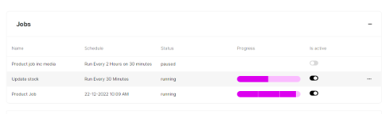

- In the job list page, we have a few pre-defined Status for a job (ex: scheduled, completed, running, stopped, paused)

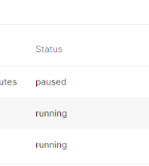

- Once the job starts running, a progress bar will appear with light pink colour and as each step is completed the bar also fills with dark pink colour simultaneously.

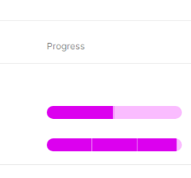

\

**Overview of the Product Page**

` `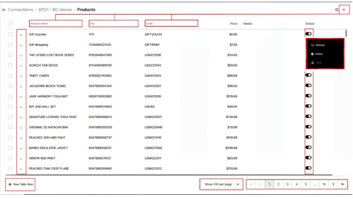

**This is the product page where all products are updated. Once the product job is completed, you can find all the updated products here. Additionally, this product page offers a range of additional functionalities for effective product management.**

1. *Product Options*
1. *Table View*
1. *Filter Button*
1. *List box* 
5. *Paginations*
5. *Expand product-cell*     
5. Status toggle

\

1. **Product option:**

1. **Refresh:**

The "**Refresh**" option serves to update a single product's data. This function, also referred to as the single product functionality, enables the refreshing of specific product information. Instead of running the entire product job, this option allows for data modification or refreshing the product based on changes in the ERP system for that product.

1. **Delete:**

The "**Delete**" option is used to remove a product. This action permanently eliminates a product's data from the Zimble and Ecommerce system.

1. **Lock:**

The "**Lock**" option is utilized to secure a product from further modifications. When a product is locked, any changes made to it will be prevented until it's unlocked.

These options provide greater control over individual product management and streamline the process by allowing specific actions to be taken without affecting the entire product set.
**\

1. **Table View:**

The "**Table View**" is an intriguing functionality that facilitates the exploration of product variants based on specific attributes. The additional attributes that become available to add to the table data set are defined in the attribute config UI. With this feature, you can conveniently access details such as **"original price," "retail price," "color," "size," "price," "code," "color label," and "season."** These newly introduced attributes enrich the product specification display.

When the "Table View" is activated, the attributes you've added become visible in a row format. This format offers a structured and easy-to-read presentation, allowing users to quickly access and compare the various attributes of different product variants. This feature enhances the efficiency of product analysis and enables users to make informed decisions based on the displayed attributes.

1. 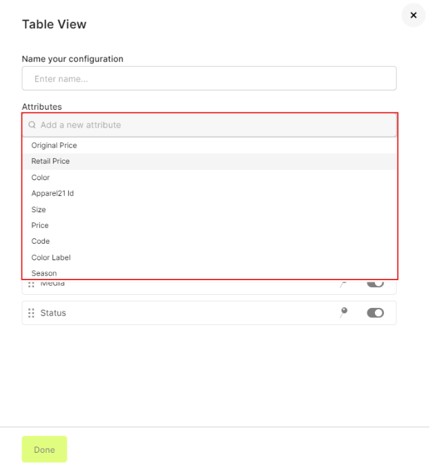
1. **Filter Button:**

The "**Filter**" option acts like a search tool, helping us quickly find products. It works by using attributes like product name, SKU, and code. This makes identifying products much easier. You'll find this helpful filter on various pages in Zimble, such as the product, order, and stock pages, as well as on the product attribute pages within the application configuration. This makes searching and locating products a breeze across different parts of the application.

**Improvement:**

We need to have the filter option for all the fields in the page wherever the icon is displayed.

Currently, we don’t have it for the price field on the product page.

1. **List box:**

The "**List box**" functionality gathers product data into a single page. By clicking on the list box, users can select the amount of product data they want to view on the page. They can choose from options like (10, 25, 50, or 100), depending on their specific needs and preferences. This feature streamlines the viewing experience by allowing users to control the quantity of product data they interact with at once.

1. **Paginations:**

This functionality is used to navigate from one page to another page.

**Improvement:**

This functionality allows users to navigate from one page to another. However, when there are hundreds of pages, it can be time-consuming to manually switch to, for example, the 50th page.

To improve this, the system should allow direct navigation by placing the page number in the URL link. When a user enters a specific page number in the URL, the system will automatically navigate to that page, providing a faster and more efficient way to access the desired page.

1. **Expand product-Cell:**

This functionality allows you to expand the product's details. When you expand the product cell, you can access its variants, such as size and color, along with other attributes. These attributes are the ones you've added to the table view table for easy reference.

1. **Status Toggle:**

The status toggle is a tool that changes the product's availability on the Zimble product page. If you turn off the toggle, the product will be deactivated on both Zimble and the linked e-commerce platform

“If the connector is Shopify, the product will be updated to draft status. If it is BC, the product will be made invisible in the BC admin”.

`                        `**Overview of the Stock Page**

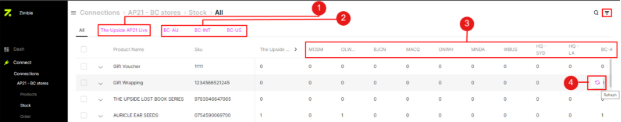 

1. **Connector Name: -**

On the stock page, you can see the connector name associated with the stock information. If you click on the connector, it will show you a list of warehouses along with the stock counts for each product and its variants. This provides an overview of how much stock is available across different locations.

1. **Multiple stores: -**

If you have multiple stores within a single client, such as AU, US, and INT stores, and you want to view the stock data for a specific store like US or AU, you can easily do so. Just click on the name of the store, for instance, "BC-AU." Clicking on this store's name will display the stock data exclusively for that specific store. This way, you can quickly access the stock information you need for a particular location.

1. **Warehouse information: -**

These warehouse names represent various locations where stock is stored. They display the stock levels associated with different stores connected to this client. Each warehouse is linked to a specific store, allowing you to see the stock levels for different stores within the client.

1. **Stock single refresh: -**

This is a singular stock refresh functionality that's specifically designed to update the stock for an individual product. When you use this stock refresh feature, it works similarly to the single product refresh functionality. In this case, you're refreshing the stock data for a single product instead of the entire stock inventory.

\
\
\
\
\
**Overview of the Order Page**

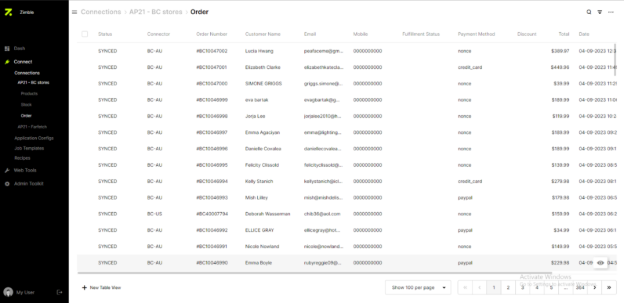

The orders page in Zimble is where you can find and manage updated orders. These orders are coming from external platforms like BigCommerce, Shopify, and others. They originate from customer purchases in the front-end store. This page allows you to view, organize, and handle these orders efficiently within the Zimble.

\
\
\
\
\
\
\
\

**Overview about the orders page options**

The Orders Page within our application offers a range of essential options to manage and monitor orders efficiently. This section provides a comprehensive overview of these options, empowering users to navigate through orders seamlessly.

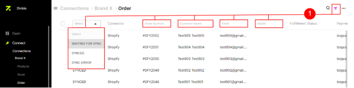

1. ***Filter option: -***

The filter options are used to locate specific orders or modify their order status, such as **"synced," "sync error,"** and **"Waiting for sync."** When we activate the filter option, fields like status, order number, customer name, email, mobile, etc., are highlighted. These fields help us locate a particular order on the order page. However, the most commonly used field for finding orders on this page is the "Order Number."

There are several filter options available, including "**SYNCED**," "**SYNC ERROR**," and "**WAITING FOR SYNC**." These options are found on the status page and allow us to filter orders based on their status.

- **SYNCED:** Orders of this type have been successfully synchronized in Zimble. These orders originate from platforms like Shopify or Big-commerce and are imported into Zimble. When synchronization is successful, these orders are updated in the corresponding ERP system.

- **SYNC ERROR:** If an order fails to synchronize in Zimble for any reason, it appears on the orders page under the "SYNC ERROR" option. This allows us to identify orders that haven't been successfully synchronized.

- **WAITING FOR SYNC:** Orders that have not been updated in Zimble require manual intervention. These orders can be manually imported using the "manual import" option, along with the order ID. This action assigns the "Waiting for sync" status to these orders.

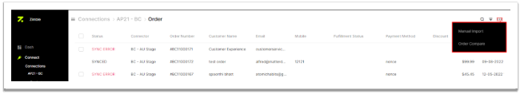

1. ***Options: -***

Upon clicking the options button, two choices become visible: **MANUAL IMPORT** and ORDER COMPARE.

- **MANUAL IMPORT:** This option serves the purpose of manually importing orders that have not been updated on the order page despite the completion of the order import process. In such cases, these orders need to be imported manually using their respective order ID’s.

To initiate a manual import, click on the "**Manual Import**" option. A pop-up titled "Order Import" will appear. In this pop-up, you will need to select the appropriate Connector Type, indicating whether the order originates from Shopify or Big-Commerce

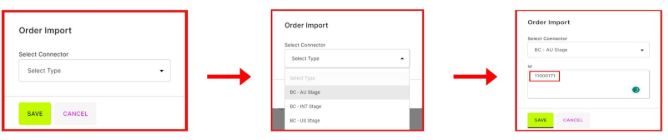

- **Order Compare:** In cases where a few orders have not been successfully transferred to Zimble, a solution is to run the "**Order Compare**" job. This job helps identify and retrieve the missing orders, making them visible on the "Order Compare" page.\
\
  This functionality is akin to the order page. If you're looking to view the orders that are missing, you can achieve this by applying a filter. Click on the filter option and select the "**MISSING**" filter. By doing so, you will access a list of the missing orders. Collect the order IDs from this list, and then use the manual import functionality to bring these orders into Zimble

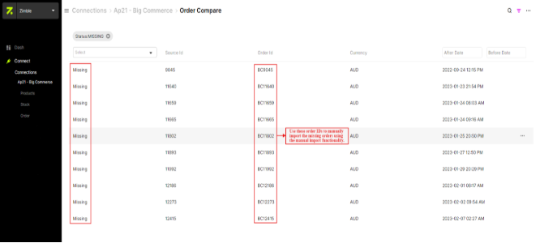

**Overview of Bulk Operations (Re-Import, Sync Again, Bulk Delete) on the Order Page**

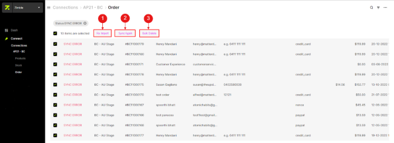

**1. Re-Import: -**

Fundamentally, the '**Re-Import**' operation is utilized exclusively for orders. In certain situations, an order might fail to synchronize with Zimble due to various reasons. In such cases, we employ the '**re-import**' option. This option allows us to re-import the order and subsequently synchronize it with Zimble.

Now, the '**Bulk Re-Import**' option serves the purpose of re-importing multiple orders that have encountered synchronization errors into Zimble. When we execute this action on the orders, several of them might successfully synchronize without necessitating the '**Sync Again**' operation.

**2. Sync-Again: -**

In situations where a few orders encounter Sync errors, we utilize the '**Sync-Again**' option to sync those orders with Zimble. This approach enables us to effectively resolve Sync issues and ensure the proper functioning of the functionality.

Furthermore, the '**Bulk Sync-Again**' functionality serves the purpose of re-syncing multiple orders simultaneously with a single click. This smooth feature simplifies the process of rectifying synchronization problems across multiple orders.

**3. Bulk Delete: -**

If we come across unnecessary orders in Zimble or encounter cases where orders need to be deleted, we make use of the delete functionality.

The '**Bulk delete**' functionality is employed to delete multiple orders simultaneously, streamlining the process of removing multiple orders at once.

***(NOTE: -*** The functionalities mentioned above (Re-Import, Sync-Again, Delete) are also accessible inside the order page.**)**

**Application Configuration**

**Application Config: -** 

The Application Config is a critical functionality utilized to integrate two components, namely ERP and E-commerce applications. It facilitates the management of data flow between ERP and e-commerce systems. To configure these application APIs within Zimble, we require the relevant details for both ERP and e-commerce components. These details typically include ERP options such as Apperal21, SAP B1, Retail Express, and e-commerce platforms like Big-Commerce, Shopify, and more.

\

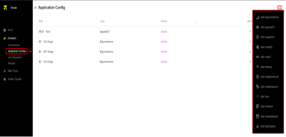

In the application configuration, multiple ERP and E-commerce connector options will be visible. To integrate new connections for clients, follow these steps:

|<h3>ERP</h3>|<h3>Ecom</h3>|
| :- | :- |
|Apperal-21|BigCommerce|
|SAP B1|Magento1|
|MagentaRetail|SFCC|
|Retail Express|OpenCart|
|LightSpeed|Shopify|
|Market Placer|Klaviyo|
||Farfetch|
||Iconic|

1. Click on the '**Add New Connection**' option
1. Select the source (ERP) connector from the available options
1. Provide the respective API credentials for the selected ERP connector. 
1. Add the destination (E-commerce) connector by choosing it from the list.

In general, SOURCE Connector is selected and created initially through Application Config option.

- Each Connector has its own details that are essential to create an application. These details will be provided by the client.

**Apperal 21**: 

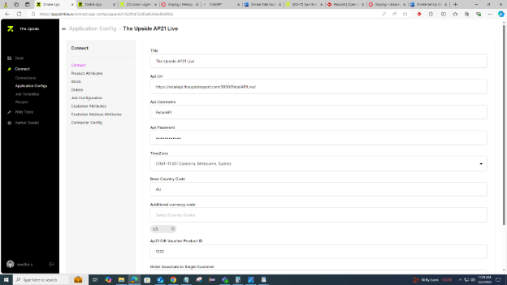

- ` `The following details are essential to create an AP21 application

` `URL, API Username, API password, time zone, base country code, AP21                            gift voucher product ID

**SAP B1:**

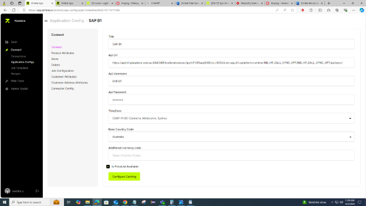

- ` `The following details are essential to create an SAP B1 application:

`                 `URL, API Username, API password, time zone, base country code

**"Essential Details and Procedure for Setting Up a BigCommerce Connector"**

To create a BigCommerce (BC) Connector, the following details are mandatory:

- **Access Token**
- **BC Client ID**
- **Access Secret**
- **Store Hash**
- **Time Zone**

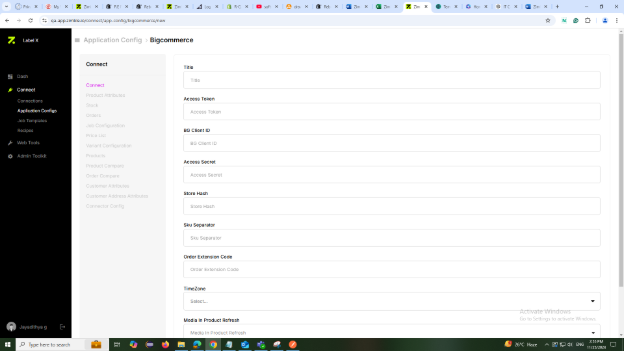
# **Adding a BigCommerce Connector**
To set up a BigCommerce connector, the specified details must be available. If these details are not provided, you will need to create an API account in the BC store for the connection.
# **Procedure to Create a BigCommerce API Account**
1. **Log into the BC Store:**
   1. Access the BigCommerce store where the connection will be configured.
1. **Navigate to API Settings:**
   1. Go to **Settings** and locate the **API Accounts** section under the API menu.
1. **Create a New API Account:**
   1. Click on "Create API Account" and assign an identifiable name to the account. This should be done at the BC store level API Create.
1. **Retrieve and Save API Details:**
   1. Once the API account is created, the required access details (Access Token, Client ID, Access Secret, and Store Hash) will be displayed.
   1. Note these details carefully and download a copy for future reference, as they may not be retrievable later.
1. **Set Up the Connector in BC:**
   1. Enter the access details into the **BC Connect** page to finalize the creation of the BigCommerce connector.

This process ensures that the BC connector is successfully integrated, enabling seamless communication between the zimble application and the BC store.

**"Essential Details and Procedure for Setting Up a Shopify/Shopify Plus”**

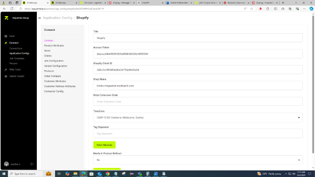

⦁	 The following details are essential to create a Shopify application:

` `Access token, Shopify Client ID, Shop name, time zone

In order to create a shopify connector, currently Zimble custom app needs to be installed in the corresponding Shopify store.

The Procedure to be followed while installing zimble app is as follows:

1\. Go to Zimble Shopify Partners account and go to APPS section.

2\. Click on **CREATE APP MANUALLY** option, enter the shop name and click on the create button.

Upon doing this, A page appear with **API KEY** details.

3\.Keep a copy of these **API KEY** details and click on **APP SETUP** menu option.

4\. Under the URL section, enter the following details:

`    `APP URL: https://stage-app.zimble.io/shopify/app/install

`    `Allowed redirection URL(s): https://stage-app.zimble.io/shopify/app/authenticate

Note: The above URLs are used in case of app installation in stage. If required in QA/Live sites, corresponding URL’s need to be provided respectively.

5\.Log into the zimble admin site and navigate to APP CONFIG option.

6\.Click on NEW button and Enter API KEY details.

7\.Fill in all the other field details by taking references from the ones already available on the APP CONFIG list page and save it.

8\. Come back to Zimble shopify partners tab and click on DISTRIBUTION option.

9\. Select SINGLE MERCAHNT LINK and proceed further. A link appears upon doing this.

NOTE: Make sure you are logged into zimble platform and present in the corresponding client.

10\. Copy the link and browse it. APP INSTALLED SUCCESSFULLY message appears.

11\. In Zimble,the Shopify Connector is visible under the corresponding client.

**Application Config**

**CONNECT:** To establish a connection, users must input the necessary access details for both the source and destination on this page. Completing the required fields ensures a seamless connection.

**NOTE**: Clients provide the source details and developers provide the destination details.

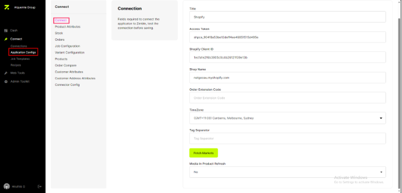

**Overview of the Ap21 product attribute** 

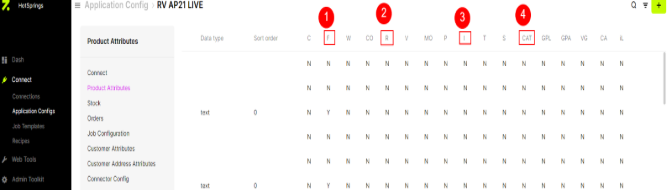

**1. F - Filter Option:** If we set** the **IS FILTER** option true for an attribute then it will enable the attribute to be used in filters for products and stock page while using the table view.

**2. R - Is Reference Group :** If the reference group option is enabled, it will fetch the reference values and groups.

**3. I - Image :** By selecting the image option enabled, it will allow the image urls through AP21 API and saves in the media.

**4. CAT - Category :** Upon selecting the CAT option for an attribute, then **t**he selected attribute to be considered as category.    

`              `**Overview of the BigCommerce product attribute**

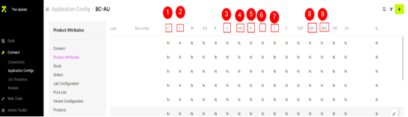

** 

**1.  C - Custom Option** : If we select an attribute as custom option, the attribute value will be populated as custom fields in **BC.**

**2. F-FLITER Option :** If we set Is FLITER option ture for an attribute then it will enable the attribute to use in fliters for products and stock page while using the view in zimble.

**3. V - Is Variant Option** :It allows the attributes to create as variants. Generally color is used as variant.

**4. MO-MetaField Option** : The MetaField enabled attributes are used for writing many operations.

**5. P-Parent :**It is used to group the products in destination.

**6. I - Image** :The images present in the attribute are populated in the image field in **BC**.

**7. T-Tag** : it will convert tags into custom fields and post in **BC.**

**8. GPL - Is Group Label :**It will reflect the attribute value in the product title which we grouped using **GPA.**

**9. GPA - Is Product Attribute :**It will divide the Products as groups based on the color, size etc.

**Overview of the Shopify product attribute**
**\

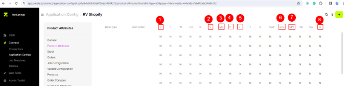

**1**. **C - Custom Option** :  It will represent as tags in shopify.

**2. V - Is Variant Option** :It allows the attributes to be created as variants. Generally, color is used as variant.

**3. MO - MetaField Option**:The attribute values are created as meta fields.

**4. P – Parent :** It is used to group the products in destination.

**5.** **I - Image :** The** images present in the attribute are populated in the image field in shopify.

**6. GPL - Is Group Label**:It will reflect the attribute value in the product title which we grouped using **GPA.**

**7. GPA - Is Product Attribute**:It will divide the Products as groups based on the color, size etc.

**8. iL-Islist** :It is used to post multiple values in the single meta field. It works only for shopify

**Overview of the Magenta Retail product attributes**

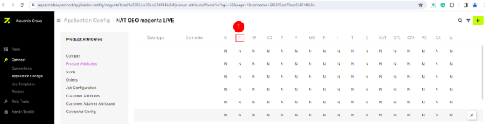

**1.C- Custom option:** If we set IS FLITER option true for an attribute then it will enable the attribute to use in filters for products and stock page while using the table view in Zimble.

**Overview of the SAP B1 product attributes**

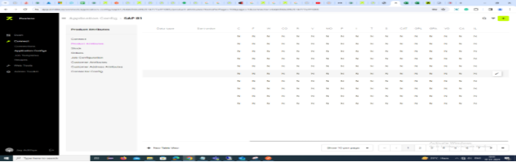

\*\* No attribute options are used in the SAP B1 connection

**Overview of the Lightspeed product attributes**

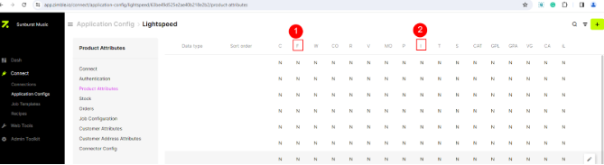

**1.F-Filter option**: If we set IS FLITER option true for an attribute then it will enable the attribute to use in filters for products and stock page while using the table view in zimble.

**2.I- Image**: By selecting the image option true, it will allow the image URLs through lightspeed API and saves in the media.

**Overview of the ICONIC product attribute**

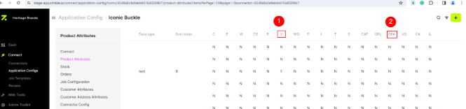

**1.V-Is Variant option**: It allows the attributes to be created as variants. Generally, color is used as a variant.

**2.GPA- Is Product Attribute**: It will divide the products into groups based on the color, size etc.

**Overview of the Farfetch product attribute** 

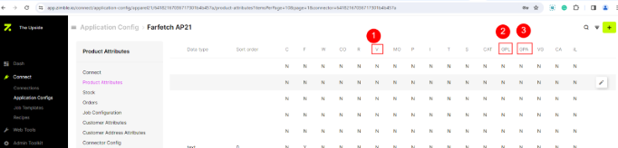

**1.V-Is variant option**: It allows the attributes to be created as variants. Generally, color is used as a variant.

**2.GPL-Is group label**: It will reflect the attribute value in the products title which we grouped using **GPA**

**3.GPA-Is product attribute**: It will divide the products as groups based on the color, size etc.

**Overview of the SFCC product attribute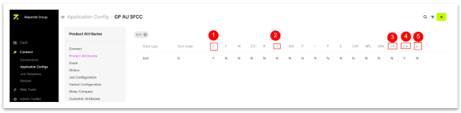**

**1. C- Custom Option:** In Shopify, meta fields are the custom option for SFCC,

where we will add the attribute data for the product in the XML file.

**2. V-Is variant Option**: It allows the attributes to be created as variants. Generally, color is used as a variant.

**3. VG-Is Variant Group**: It will divide the products as groups based on the color, size etc

**4. CA-custom Attribute**: It is used to group the variants in SFCC

**5. IL-is list**: Product custom attributes in SFCC

**Overview of the Klaviyo product attribute**

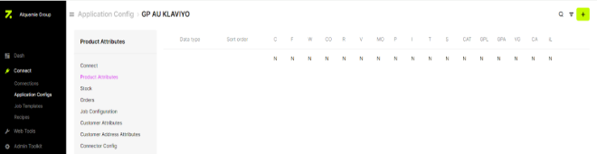

**\*\* No attribute options are used in the klaviyo connection**

**STOCK:** On this page, clients input their store outlet information along with a unique source ID. New stock stores can be added either manually or through a job run. There are two functionalities, 

**1.** **Status**: Enabling the store status triggers stock updates.

**2.** **Show as Location**: Enabling this option allows the display of locations in the Admin Toolkit page.

**Bulk Stock Data Management:**

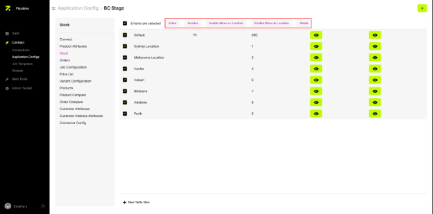

Select Checkboxes:

A dropdown will appear with two options:

**All**: Apply the action to all items on the page.

**Per** **Page:** Apply the action only to the items visible on the current page.

Available Actions:

Once "All" or "Per Page" is selected, a set of options will become visible:

- Activate
- Inactivate
- Enable Show at Location
- Disable Show at Location
- Delete

**Apply Action:**

Select the desired action from the list. Once selected, the bulk data will be updated according to the chosen option.

**ORDERS:** The Orders page encompasses two key functionalities: Payment Method and Shipping ID. These functionalities are meticulously mapped to ensure synchronization between the ERP and E-commerce systems when an order is placed.

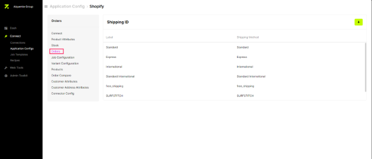\
\
\
**Job Configuration**

**What is Job?**\
Job is a set of tasks implemented in the source and destination adapters.

We commonly have some jobs for all clients such as Product, Stock, Order, and Shipping jobs and there is a high chance of implementing new jobs as per client requirements.

\

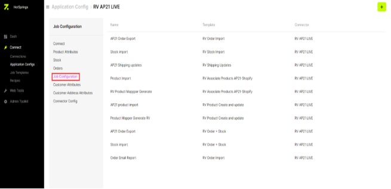\
In Job Configuration, we can create jobs by adding tasks as per job requirements which are mentioned by developers.

**Let's see how the product build job is configured.**

The flow of the product build job is to get product information from source (So, the first step is created in the source connector) and push to the destination (next step is created in the destination connector).

Every job has a different flow hence the job steps are created according to the flow.

Firstly, click on the Add Job (+) button and you will see configuration settings page as below

- Add a name for the configuration as to how this step is used in the job. 

For example, the first step for the product build job is to get product information from the source (here the source is AP21). The name given is AP21 Product Import i.e., Product information is fetched from the AP21.

- Add a template name which is job name (product build, Stock Import, etc...)
- Drag and drop the tasks used in this step which will be mentioned by the developers and click save.

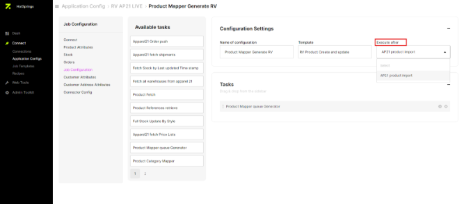

- Again, click on add new job create a name of configuration and select the template from the dropdown (only in the first step you need to give a template name, from the second step you will get the dropdown with the template name created).
- Here is a new dropdown “Execute After”, click on it to select the last step you created.
- Drag and drop tasks and save.
- After completing all the steps in source connector. Move to the destination connector.
- Continue the same process, create the steps using the same product build template.
- The number of steps and the tasks involved in the steps will be given by the developers. 

**Job Templates:** 

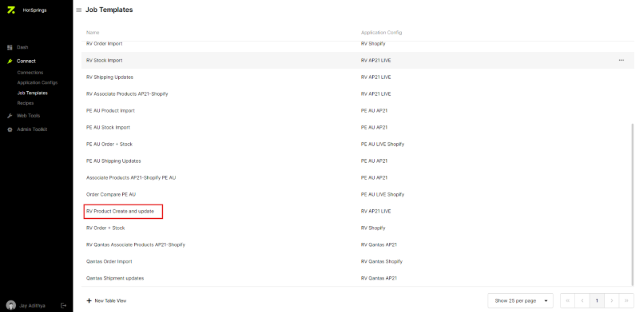

- The Product build job is created, you can check it in the Job Templates page above or while creating a new job the template is visible in the template dropdown.

So, every job template should be created like this.

**Let's see the flow for every job template:**

- Product Build - Fetches product information from Source and pushes to destination (Source to Destination)
- Warehouse Import – Fetch all warehouse locations from source and saves in Zimble (Source to Zimble)
- Stock Import - Fetches stock from the source and updates in the destination (Source to Destination)
- Order import – Fetches the order details from destination and pushes to the source (Destination to Source)
- Shipping Updates – Fetches the shipping details (partially shipped, shipped) from source and updates in the destination (Source to Destination) 
- Order Compare – Fetches all orders from destination and compare with the orders in Zimble and display as missing orders in Zimble (Destination to Zimble)
- Associate Products – Fetch products from source, saves in zimble and fetch products from destination, compares with the products in zimble and saves the missing products in Zimble (Source to Destination)
- Media Import – Fetch media from source and updates in destination (Destination)
- Price Markdown – Fetch prices from source and updates to destination (Source to Destination)

**PRICE LIST:** This feature is integrated into The Upside connection to obtain separate pricing for all products across various stores.

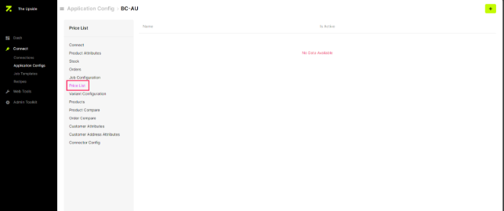

**VARIANT CONFIGURATION:** The sizes and colors are arranged in either ascending or descending order to ensure a systematic arrangement for configurable products.

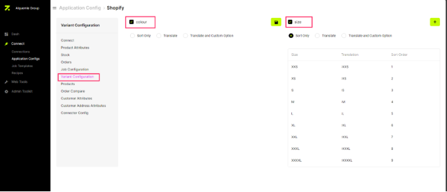

**PRODUCTS:** To be visible only for all the configurable products.

When we run a product job, once the products are created in zimble and didn’t in their destination due to any reason, those products are shown with errors in this page.

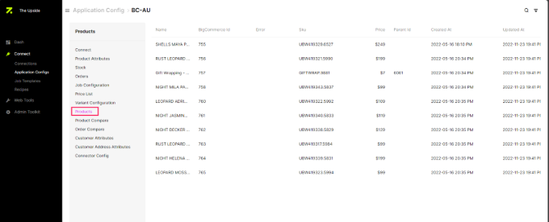

**PRODUCTS COMPARE:** 

All the products created are analyzed and compared.

These options should be displayed under connections so that clients should also be able to view the errors for products.\
Ex: BigCommerce

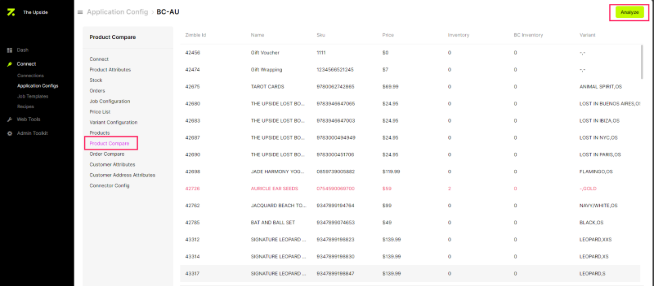

**ORDER COMAPRE:** On this page, users can identify missing orders, prompting them to re-import and synchronize the orders once again when an order compare job runs.

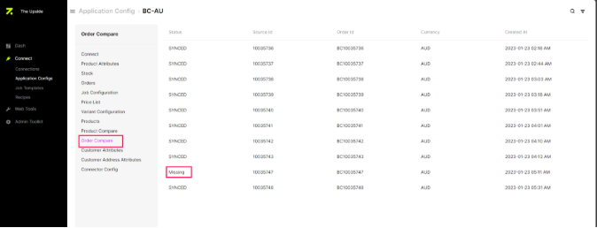

- **CUSTOMER ATTRIBUTES:**

A **customer attribute** is a characteristics used to describe and define a customer. Businesses utilize these attributes to gain a deeper understanding of their customers. Examples of customer attributes include **first name**, **last name**, **email address**, and **country**.

**CUSTOMER ADDRESS ATTRIBUTES:**

It is only being used to display fields in the recipe for now.

A **customer address attribute** refers to the specific details related to a customer's location or address. This information is used by businesses for purposes like shipping and location-based services.

**CONNECTOR CONFIG:** In this functionality there are two i.e. App Configuration and Global configs.

- **1.App Configuration**: If we have configurations specified in the connector settings, we utilize them to process data from Zimble to the destination.\
  **Product**\
  **Order**\
  **Customer**
- **2.Global Configs:**\
  **Sales Channel** – This feature will make the stores/channels visible in E-commerce to know a single product is assigned to multiple stores.

**Recipes**

- **Recipes:** - 

Recipes is a second level menu option under Connect and is sub categorized into following:

- **Product recipe:** -
- Created by selecting source and destination.
- Dev team provides a basic mapping list based on client requirements and product structure.
- Source attributes are mapped to corresponding destination attributes.
- A text field allows entry of text, formulas, HTML code, or perform mathematical operations applied to source attributes before mapping to destination.
- Once created, a connection is formed between the corresponding source and destination applications.

- **Stock recipe:** -
- Similar to Product Recipe, created by selecting source and destination.
- Warehouses for the source are mapped to destination warehouses as per client requirements.
- Text field allows for the inclusion of mathematical operations if needed.
- **Order recipe:** -
  - Created by selecting destination on the left side and source on the right side.
  - Involves mapping shipping methods and tax based on client store details and preferences.

**Customer recipes:**

- In customer recipes, source attributes are mapped to corresponding destination attributes. It is important that the customer's first name remains consistent in both the source and destination.
- Not compulsory for each client connection 

- **Price list:** -
- Not compulsory for each client/connection.
- Mapping is done to see if pricelists are available for a client.
- These recipe functionalities streamline the mapping process, ensuring seamless data transfer and customization based on client-specific requirements around prices.

  

**Web-Tools**

`                 `

It appears that "Web-tools" is a toolkit within Zimble, and it consists of various options, including: -

1. Translator.
1. Media.
1. Data Sets.
1. Data Exchange.  

**Translator**

The "*Translator*" functionality in your system, specifically in Zimble, serves as a bridge between the SOURCE and DESTINATION connectors. This functionality is designed to transform or convert data from one format in the source connector to another format in the destination connector.

` `***For Example: -*** The Source has a product color named "White Pink," but you want to represent it as simply "pink" in the Destination. The Translator option facilitates this conversion by handling the transformation of data, ensuring that the information transferred from the Source to the Destination is in the desired format.

`       	`\
**Adding a Translator: -**

To add a new translator, follow these steps:

Click on the "ADD" option on the right side of the top corner: -

A pop-up titled "*New*" will appear. In this pop-up, you will find three sections: "SOURCE," "Destination," and "GROUP."

- In the "***SOURCE***" section, specify the field that needs translation.
- In the "***DESTINATION***" section, provide the name or format you wish to translate the data into.
- In the "***GROUP***" section to organize translators into specific groups. Grouping is beneficial for managing and categorizing translators, especially when multiple translators are related to a specific field in the Destination. For example, you might create a group for all translators related to color filters.

By incorporating this Translator functionality, Zimble streamlines the process of data transformation, allowing users to customize and ensure that the information reaches the Destination in the intended format.

**Media**

The Media Functionality in your application plays a crucial role in facilitating the import of product images and swatches based on a predefined Media recipe. This functionality simplifies the process of managing and incorporating visual elements into your application, enhancing the overall product presentation.

\
**Configuring Media Source in Zimble: -**

Before importing images into your application through Zimble, it's essential to configure the corresponding media source. The configuration process involves adding the source, which could be platforms like Google Drive, OneDrive, AWS (S3), SFTP, etc. Follow the steps below to set up the media source. 

**Access Configuration: -**

Click on the "ADD" option located in the right corner of the page. This initiates the process of adding a new media source to Zimble.

**Configuration Page: -**

- After clicking "ADD," you will be directed to a configuration page.
- On this page, you'll find options related to setting up the media source.

**Import options: -**

Specify what you would like to import by selecting from the available options:

- *"Product Images"*
- *"Swatches"*
- *"Videos"*

**Mapping Preferences: -**

Define the mapping preferences by choosing the type of mapping for your files and directories. Options typically include:

- *"Files"*
- *"Directories"*

**Configuring Media Source in Zimble: -**

\
**Import Options: -**

On the configuration page, choose the type of media you want to import. Select from the following options:

- "Product Images"
- "Swatches"
- "Videos"

**Mapping Preferences: -**

Next, specify the mapping preferences based on the structure of the media data. Choose from the available options:

- "Files" if the media data is available in a file format.
- "Directories" if the media data is organized in directories.

**Setting up Media Cloud Source in Zimble: -**

- When you choose the two specified options, two dropdowns will appear labeled **'Source**.' Once these dropdowns appear, click on the dropdown titled 'Please select a source and folder to import from.' Upon clicking, you will need to set up the Cloud source by selecting the option 'Please set up Cloud source.'

- Upon selecting this option, you will be redirected to the 'Cloud config' page within the admin toolkit. Navigate to the 'Cloud config' page and proceed to add the source by selecting 'Select a source config' from the three dots located in the top-right corner.

- Based on your selections, proceed with configuring the media source by providing necessary details such as authentication credentials, API keys, or connection parameters specific to the chosen source **(Google Drive, OneDrive, AWS(S3), SFTP, etc.).**

**Media import Process in Zimble: -**

\
After successfully completing the configuration, you will be redirected to the Media page. Click on 'Add' and choose the type of media you want to import, such as 'Product image,' 'Swatch,' or 'Video.' Additionally, select the mapping type as 'File or Directories.'

Once these options are selected, proceed to choose the Cloud source and select the appropriate connector for importing the media. After selecting these mandatory options, you will have access to the Media folders. Open the folder where the product images are available.

`                            `

1. **Product images: -** The images that you need to import into Zimble.
1. **File: -** Select the desired mapping type, either "File" or "Directories." 
1. **Select the Configured Media Source:**
   1. Choose the previously configured Cloud source (e.g., Google Drive, AWS(S3), OneDrive, SFTP).
1. **Select the Respective Connector:**
   1. Choose the connector that corresponds to the chosen Cloud source. This connector facilitates communication between Zimble and the selected source.
1. **Image Folders:**
   1. After selecting the Configured Media Source and Connector, you will gain access to the image folders within the chosen Cloud source.                                                                                     
1. **Additional Options:** Along with the image folders, you will encounter two additional options:     
   - **Auto Analyze:** 
   - **Use Recipe:** 

- The "**Auto Analyze**" functionality in Zimble utilizes the current system to automatically analyze media files, such as images, during the import process. This feature employs an algorithm to identify data chunks within the file names of the media and queries the Zimble database to find a matching association.

- The "**Manually Associate**" functionality is a new feature that empowers users to create and apply restricted recipes within the media flow process in Zimble. This functionality provides a manual approach to associating media files with specific products or categories. The key characteristics of this feature are as follows:

\
**Creating Recipes: -**

Users can create customized recipes that define how media files should be associated with products. These recipes serve as guidelines for the manual association process.

**Separators: -**

\
The "**Separators**" functionality in Zimble involves the automatic detection of separators in media file names. A pre-defined list of preferred Zimble separators, including '\_', '@', and '-', is utilized for this auto-detection process. Key points regarding this functionality are as Follows: - 

**Auto Detection with Preferred Separators:**

- Separators, which are characters used to delimit or distinguish elements in a file name, are automatically detected during the import process.
- A predefined list of preferred separators, including '\_', '@', and '-', is employed for the auto-detection process.

**List of Current Separators: -**

- The separators currently considered are:
  - **'\_'**
  - **'@'**
  - **'-'**

**User Override Option: -**

- Users have the option to override the auto-detection process and manually define separators.
- This manual definition can be done by entering a single character or a series of characters in the dedicated "manual separator" form field within the user interface.

**Custom Character Sets**: -

- The characters set defined by the user can include any single character or a set of characters.
- It may also encompass a single space or a series of spaces. 

**Flexibility in Separator Definition**: -

- This functionality provides flexibility by allowing users to specify separators that align with the naming conventions or preferences specific to their media files.

**Manual Separator Form Field UI: -**

- Users can input their desired separators in a user-friendly form field provided in the UI, offering a straightforward way to customize the separator settings.

The "**Separators**" functionality, with its combination of auto-detection and user override options, ensures adaptability to various naming patterns and user preferences. It allows users to tailor the separator settings based on the characteristics of their media file names. 

**Data chunks: -**

\
In Zimble, when a separator is applied to an image file name, the file name is divided into smaller parts known as "data chunks." Each data chunk corresponds to a distinct attribute or piece of information within the file name. The purpose of these data chunks is to organize and categorize the information, making it easier to manage and associate with specific attributes. Here is a breakdown of how data chunks work in

\
\
**Sequence: -**

\
The sequence plays a crucial role in determining the order for importing, exporting, mapping, or analyzing/associating images.

To achieve this, we utilize separators, data chunks, and sequence elements to construct a recipe. This recipe is then used to manually associate images with products, ensuring a structured and organized process.

The features mentioned above represent the fundamental requirements for this module. However, it's important to note that there are additional improvements slated for implementation in the module, which are not currently reflected in the existing designs.

**Media:** 

Through the media file, we can check if the product image is available in the BigCommerce store. In Zimble, if the media is mapped as 'Yes,' the image should display in the BigCommerce store. If mapped as 'No,' the image will not be shown."

This explanation highlights that the image will appear in the store only when the media mapping is set to "Yes." If it is set to "No," the image will not be displayed.

**Data sets – lookup Table**

The primary purpose of implementing the Data Sets module is to create and edit data within user-customized tables. The Data Set, an evolution of a translation table, provides Zimble with enhanced flexibility. These data sets can be utilized while creating rules in the rule engine, contributing to Zimble self-sufficiency.

In the Data Sets module, users can create columns and rows, defining them with precision. Currently, data can be added manually, but there is a potential extension for future capabilities, allowing direct data import from files.

`                     `

**Create a Data Set: -**

- Navigate to the Data Set under web tools to view available data sets on the list page.
- To create a new data set, click on the "+" icon and provide a name for the data set.
- Delete a data set by selecting the available delete option.

`                  `

`                     `

**Create a Columns and Define Them: -**

- In Data Sets, create customized columns by clicking on "Add column" beside the Data Set title field.
- Define the type of column being created (e.g., text, numbers, email) during the creation process.
- Multiple columns can be created for a table.                                                                                                         

\
**Rules for Creating Data Sets and Columns: -**

- Data sets should be independent of clients.
- No two data sets can have the same name.
- Defining the data type and label is mandatory when creating a column.
- Include a delete option to remove a column.
- Defining at least one column is mandatory to create a data set.

**Create Rows and Define Them: -**

- Click on the '**manage**' option beside the data set to find a create (+) option for adding a row.
- Create a row by entering data into the respective columns.
- All columns of a particular row must be filled to create that row.
- Edit or delete a row by selecting the edit and delete row options.
- Enter only the type of data defined during the creation of the specific column.

These guidelines ensure a structured approach to creating, managing, and utilizing data sets within the Data Sets module.

`                       `

**Data Exchange**

Zimble features a robust CSV import and export functionality, allowing users to seamlessly manage data transfer to and from Zimble using CSV or XML formats. This feature incorporates a user-friendly data exchanger interface that empowers users to configure and execute data import and export operations efficiently.

**Export Story: -**

- User selects the data export option within the Zimble admin panel.
- In the data exchanger interface, the user chooses the desired connector (CSV, XML) for exporting data.
- The user selects the entity type (e.g., product, order, customer, stock) for data export.
- The interface displays available attributes based on the chosen entity type.
- User either selects an existing CSV template or adds template headers, incorporating attributes, validation rules, and drag-and-drop functionality for mapping entity values.
- Upon completing the configuration, the user can save the template for future use.
- The user has the flexibility to update, add, or delete fields within the template as needed.
- Zimble generates a CSV file based on the template, accessible for download from the admin panel, complete with the date and time of generation.

**Import Story**: -

- User selects the data import option from the Zimble admin panel.
- In the data exchanger interface, the user can either select an existing template or manually create a new template for data import.
- User adds validation rules and specifies field types in the import template.
- Similar to the export feature, the interface facilitates drag-and-drop functionality to map destination fields to the corresponding attributes in Zimble.
- User saves the configuration, including selecting the source location (e.g., SFTP, cloud storage), with the option for single or multiple export locations.
- Zimble retrieves the specified file from the configured source location, importing the data into the Zimble database while applying configured validations and field mappings.

By offering this comprehensive CSV import and export feature, Zimble empowers users to effortlessly manage data in multiple formats, fostering seamless data exchange between Zimble and external systems.

**Admin Toolkit**\
**Locations**

The "**Locations**" functionality in Zimble allows users to manage warehouse locations efficiently. This feature is particularly helpful when updating warehouse information during the execution of the "**Warehouse Fetch Job.**"

**How it works: -** 

- The "Warehouse Fetch Job" retrieves data from the API and automatically updates the warehouse location information in the Locations page.

- If there are instances where the locations are not updated during the Warehouse Fetch Job, users can manually add them by utilizing the "Add Location" button located in the right corner of the Locations page.

**Options Available: -**

- The Locations page offers various options for managing warehouse locations, though not all options are currently in use. Future updates will enable users to utilize each of these options based on their specific needs.

**Users**

`                             `

The "**Users**" functionality in Zimble is designed to oversee application access according to user roles. Users can be invited or added through the available Invite options. Three distinct user types exist, each granted specific permissions:

**Super Admin: -**

- Has comprehensive access to the entire application.
- This role is intended for administrators with overarching control.

**Standard User: -**

- Access is limited to specific functionalities within the application.
- Designed for users who require access to a subset of features.

**Client User: -**

- Exclusively created for clients.
- Access is restricted to Connects, Web Tools, and the Admin Toolkit.
- Tailored for clients who need specific tools and features.

Users are categorized into these roles to ensure appropriate access levels, maintain security and provide a customized experience based on their role within the organization or as a client.

**Roles**

Zimble currently features three user roles:

**SUPER ADMIN: -**

- Access to all options available in Zimble.

**CLIENT ADMIN: -**

- **Connect:** Only Connections (Product, Stock, Order).
- **Webtools:** Translator, Media.
- **Admin toolkit:** Users (All permissions), Locations (Edit, Delete), Roles (List only).

**STANDARD USER: -**

- **Connect:** Only Connections (Product, Stock, Order).
- **Webtools:** Translator, Media.

**General Permissions and Their Meanings: -**

- **LIST:** View corresponding option and list page. Primary permission required to see the option in Zimble
- **CREATE:** Add a new record.
- **EDIT:** Modify details of an existing record.
- **DELETE:** Delete a record.

**Permissions for Admin Toolkit: -**

- **USER:** LIST, CREATE, EDIT, DELETE (Admin toolkit > Users).
- **USER GROUP:** LIST, CREATE, EDIT, DELETE (Admin toolkit > Roles).
- **ACCESS LIST-VIEW:** View all permissions available on the roles page.
- **WAREHOUSE:** LIST, CREATE, EDIT, DELETE (Admin toolkit > Locations).
- **CLIENT:** LIST, CREATE, VIEW (Admin toolkit > COMPANY DETAILS). If a user account needs to be with multiple clients, ensure CLIENT-LIST and VIEW permissions are given.
- **EVENT FLOW:** (Admin toolkit > Rules Engine).

**Permissions for Web Tools > Translator: -**

- **TRANSLATOR:** LIST, CREATE, EDIT, DELETE.

**Permissions for Web Tools > Media: -**

- MEDIA, MEDIA PRODUCT, MEDIA CONFIG, MEDIA RECIPE, ONE DRIVE CONFIG, GOOGLE DRIVE CONFIG, GOOGLE DRIVE, S3.
- To fully access WEBTOOLS > MEDIA options, grant all the above permissions.
- MEDIA PRODUCT-LIST: Specifically related to media in the view order page.

**Permissions for Connect > Connector Mapping**: -

- **CONNECTOR MAPPING-LIST**: Grants visibility to the Connections option, excluding Jobs and Notifications.

**Permissions for Connect > Jobs and Notifications: -**

- TEMPLATE SCHEDULE.
- SCHEDULE.

These permissions are interdependent, enabling visibility of Jobs and Notifications sections.

**Permissions for Connect > Job Templates**: -

- TEMPLATE-LIST ALL.
- SCHEDULE CONFIG-LIST, VIEW.

These permissions are necessary for new job creation and editing existing jobs in connections

**Permissions for Main Dashboard Notifications: -**

- MESSAGE.

**Permissions for Job Logs**: -

- JOBQUEUE-LIST, BULK DELETE.

**Permissions for Connect > Job Templates: -**

- TEMPLATE-LIST, DELETE.

**Permissions for Connect > Connector Configuration: -**

- **CONNECTOR CONFIG-EDIT**: Needed to edit the connection name.
- **CONNECTOR CONFIG**: Related to Application config option under Connect.

**Permissions under ENTITY**: -

- Related to Connection > Products option and product actions (refresh, disable, lock, delete).

**Permissions under ORDER**: -

- Related to Connection > Order option and actions available in the order view page (print payload, reimport order, resync order).

**Permissions for ATTRIBUTE**: -

- **ATTRIBUTE-LIST:** Necessary to see filter-enabled attributes in the table view.

**ATTRIBUTE-CREATE, EDIT, DELETE, VIEW:** Related to product attributes option in Application config edit page.

**Permissions for Connect > Connector List: -** 

- **CONNECTOR LIST-LIST:** Related to the list of all available connectors in the application config option.

**Permissions for Connect > Variant Configuration: -**

- **VARIANT CONFIG:** Related to variant configuration option available for BC and Shopify connectors in the corresponding Application config edit page.

**Permissions for Connect > Shipping Configuration**: -

- **SHIPPING CONFIG:** Related to shipping options available for connectors in the corresponding Application config edit page.

**Rules Engine**

**Rules Engine Overview**: -

- A rules engine is essential to address recurring data mismatches between applications and enhance our logic for managing taxes. Additionally, there's a distinct requirement from multiple customers regarding order routing and actions, which can be efficiently combined within the same rule's engine.

**Functionality and Implementation:** -

- A Magento-like rules engine will be implemented for flexibility and scalability.

- A 'rules engine' toggle may exist in the connection order admin UI, allowing users to switch on rules or hide them and only reveal when the 'apply order processing rules' toggle is set.

**Order Management Types**: -

- **Pre-Order Processing Tasks**: - Order Routing: Routes orders to different endpoints or APIs based on attributes or origin.
  - Order Attribute Routing: Requires order payload mapping.
  - Order Origin Routing: Simple routing using the source as the identifier.
- **Order Allocation:** -Assigns orders to branches or locations based on application-specific requirements.

**Post-Order Processing Tasks**: -

- Configurable post tasks for error management in the order config UI.
- Handling post fail error codes, resolving order post errors, order manipulation, string length adjustment, tax calculation, and total order value adjustments.

**Use Cases: -** 

- Illustrated with the example of DeBras REX implementation, where rules are applied based on stock levels and weighting to assign orders to specific stores.

**Order Manipulation: -** 

- Before posting an order, manipulation may be necessary, such as order payload mapping, translation tables, and find/replace mechanisms.

**Granular Error Handling: -**

- Rules are triggered selectively based on error codes, ensuring that only orders with errors undergo rule-based management.

**USA Tax Adjustment**: -

- Granular error codes are crucial for managing tax discrepancies, such as adjusting the USA tax percentage dynamically based on Avalara calculations for different regions.

**Architecture and Flexibility**: -

- Modeled after Magento's stacked selection and definition UI for maximum flexibility.

**Application-Specific Rules**: -

- Recognizes that each connection between applications may have unique rule requirements, allowing for custom rules per client.

**Customization**: -

- Provides a configuration point for creating client-specific rules, including the possibility of running custom scripts for advanced functionality.

**Rules Engine Queue**: -

- Error orders are moved to a dedicated rules engine queue to ensure seamless order processing.

**Alert System: -**

- Alerts are sent as a final step, avoiding unnecessary notifications for orders that the rules engine can manage.

**Sophisticated Alert Messages**: -

- Implements a more sophisticated alert system to avoid flooding client inboxes, with a tapered delivery approach for persistent errors, including email frequency adjustments.

**Future Enhancements**: -

- Consideration for implementing alert messages through SMS or phone calls in the future to further enhance the alerting system

**Cloud Config**

The "**Cloud Configurating**" functionality in Zimble streamlines the configuration of client cloud services, such as OneDrive, Google Drive, AWS (S3), and SFTP. To initiate the configuration process for a specific platform, users are required to provide essential credentials, including Access Key, Access Secret, and other relevant details. Once configured, these cloud drives seamlessly integrate with the Media page, allowing users to access and manage product images, swatches, videos, and other media assets within the Zimble application.

`            `

**Configuration Process**: -

- **Accessing Cloud Services: -**
  - Users initiate the configuration process by selecting the desired cloud platforms (OneDrive, Google Drive, AWS, SFTP).
- **Configuring Drives: -**
- Within the configuration interface, users specify the necessary details for each selected cloud platform, ensuring a secure and accurate setup
- **Interlinked Functionality: -**
  - The configured cloud drives become interlinked with the Media page, establishing a seamless connection between cloud storage and media management within Zimble.
- ` `**Media Access: -**
  - Once the respective cloud platforms are successfully configured, users gain access to the Media option in the WebTools menu. This access enables efficient management of product images, swatches, videos, and other media assets directly from the web interface.

`                                                                          `**Global Config**

To display configurations that are global to the client but currently it is used only for clear notifications.

# `                                                    `**Improvements:**

**Jobs:**

When a particular job is in **active status**, it should automatically be positioned at the top of the list for easy visibility. As soon as the job changes to **inactive status**, it should move down the list to its appropriate position, ensuring that active jobs are always prioritized at the top and inactive jobs are listed lower.

**Search:**

Currently, we have a search button that is not yet implemented. While implementing the search functionality, ensure that it can locate and navigate to any feature within Zimble.

For instance, if a module name is typed into the search bar, a dropdown should appear displaying features that match the entered name.     

**Edit button:**

When a user wants to edit a product attribute, they can click on the **"Edit"** button next to the attribute. Upon clicking, it will open the **specific attribute page** where the user can modify the details of that attribute.

**Hover Descriptions for User Guidance:**

`                        `To enhance usability and ensure a seamless experience, hover descriptions should be 		implemented for all modules and features within Zimble. 

When a user hovers over a specific module or feature, a brief yet informative tooltip should 	appear, providing its definition, purpose, or key functionality. This feature is especially beneficial 	for first-time users, helping them familiarize themselves with Zimble's capabilities and navigate 	the platform with confidence. 

By offering immediate context and clarity, hover descriptions can reduce confusion, improve user 	engagement, and promote efficient use of the system. Additionally, this functionality can serve as 	an on-the-go reference for existing users, ensuring that Zimble remains intuitive and user-friendly 	for everyone. 

**Optimizing Idle Session Management for Enhanced**

**User Experience:**

**Current function:** When a user is idle for 15 minutes, the Zimble app automatically logs out.\
` `**Improvement:** The 15-minute logout (13 minutes of standard time and 2 minutes of logging out popup) feature should not be required for version X.

\
` `Because we have to login every time if timeouts and the user is directed to dashboard where users previously working pages are closed and need to navigate to them again which will be time consuming.

**Invite Email Clarity with Expiry Information:**

**Current function:** When a user is invited, an invite email is sent to the user where there is a set password link which will expire in 15 mins. But it is not mentioned in the email.

**Improvement:** There should be a text saying "This link will expire in 15 minutes" in the invite email to avoid login issues.

**Client-Specific Notification Alert for Product Refresh**

When initiating a single product refresh for a specific client, a popup should appear, informing the user about the expected number of notifications that will be generated. The number of notifications, such as 5 or 6, will vary depending on the client's configuration and requirements.

This popup serves to provide clarity and set expectations for users, ensuring they are aware that these notifications can be found in the notifications section of the job list page. 

This enhancement aims to improve user awareness about the single product refresh function.

**Note:** There is already a popup when single product refresh is done. We can add this requirement to the existing popup.

Also, If the refresh is failed for any reason, we should be able to view that error just like for the product job.

**Dynamic Connection Menu for Enhanced Navigation**

We are enhancing the Connection menu to make it fully dynamic, adapting to the configuration and functionality available for each client. This menu, which includes the Product, Stock, and Order pages, will now adjust based on the configured connections:

1. **Conditional Rendering**:

   1. If a connection is not configured for inventory management, the corresponding menu item (e.g., 'Stock') will not be displayed. This ensures the menu remains relevant and clutter-free, showing only options applicable to the user's setup.

1. **Expandable Features**:

   1. When additional features are enabled, such as customer management or coupon management, corresponding menu items will automatically appear. These items will allow users to access and manage data related to these features seamlessly.

This dynamic adjustment of the Connection menu enhances user experience by providing a clean, context-aware navigation system tailored to the specific needs and configurations of the client.

**Mathematical operation in recipes page**

When a user wants to remove a recipe, the mathematical operation should update according to the alphabet.

For example, if user want to remove 'c1' recipe 

Additionally, the source and destination related to 'c1' should be removed from the recipe list, and the remaining recipes should shift upwards. 

The formula in the text field should automatically adjust to reflect these changes according to the updated recipe list."

**JOB logs deletion**

Currently, we have functionality as the job logs will be automatically deleted after 24hrs of the job run. Because of that when a developer is busy and has to de-bug an issue after 24 hours, the logs are getting deleted, and have to run the job again. 

To avoid this it would be great if we can restore the jobs for 3 days and the logs should automatically be deleted after 3 days. 

Or we can change the code in such a way that the successful logs should get deleted after 24 hours and the failed logs should get deleted after 5 days or something.

By doing this we can save time and process of re-running the job in order to debug the issue.

**Job logs error messages**

Currently, we are getting an error message, but it is not understandable by anyone except Devs and need to divert to dev's to explain it.

**Import and export functionality for data in zimble**

Currently, we don’t have any import and export functionality of any data in Zimble.

If we have to add some translations, we need to add them manually even if they are 200.

Even the products and stock information should be imported or mainly exported to cross-verify any data.

Hence, implementing the import and export functionality is very important in zimble X.

**Locations in Zimble**

Currently, all the locations that are enabled have stock flow to zimble and the ones that are mapped are updated to destination. However, it is difficult to check the correct stock in Zimble because of this. This is a major problem especially for AGH clients.

**Stock buffers**

Currently, we can't see the stock after the buffer is applied in Zimble. If we have the option to view that, we can cross-verify the stock from Zimble.

**When a job runs**

Currently, we are getting an email when a job has failed logs. however, there is no much information in it as we can't understand which products got affected in that particular run.

**Login functionality issues**

Currently, we have multiple issues with the user login like the invite user doesn't work for the AUS clients for the first time, if we delete and reinvite, then the invite would work. Also, the email link would expire after 15 minutes but it's nowhere mentioned. We need to work on all those and make the invite user functionality rock solid

**Translators Improvements**

sometime in translations, we add "shop>shop all" in zimble and the data we get includes spaces at the end like "shop>shop all  ". In this case, zimble should able to trim the extra spaces and translate the value.

**Product and stock search**

Currently, we are searching for a product with a code and get the SKU from that product's page and search the stock with that SKU. We need to have a common attribute with which we can find the data on all pages

</PasswordGuard>