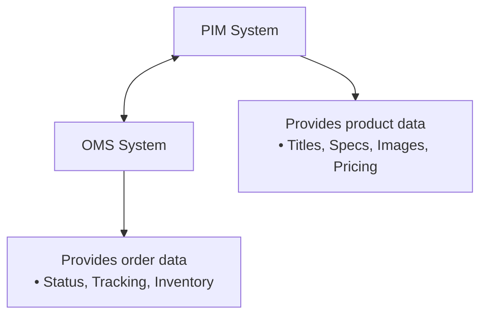
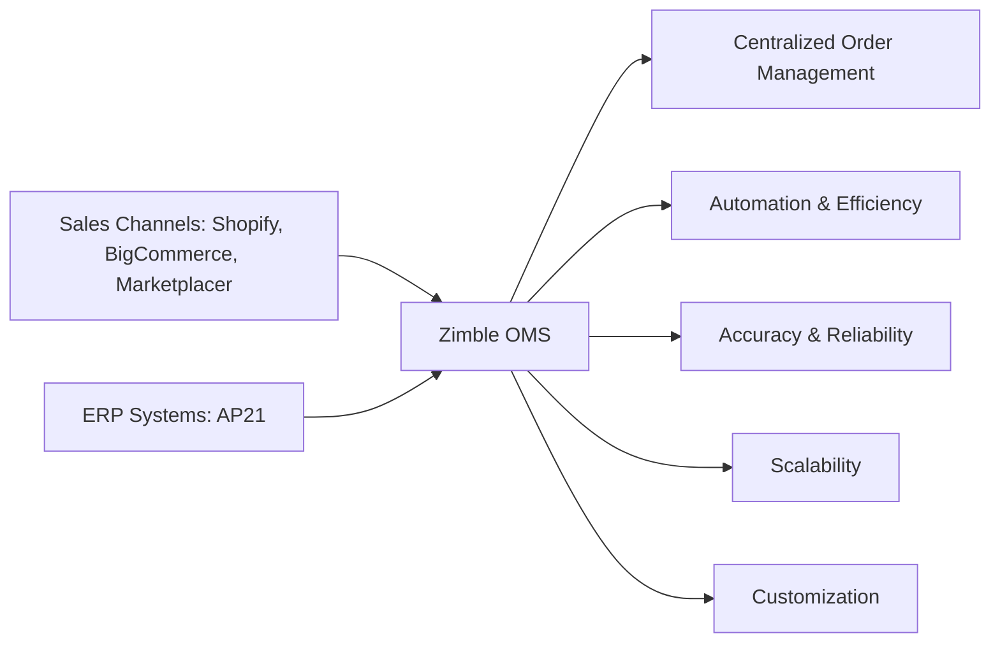

import { MainPasswordGuard } from "@site/src/components/PasswordGuard";

<MainPasswordGuard>

# Zimble - X
Zimble-x is a advance level dynamic, digital ecosystem that integrates, connects, and streamlines business processes for eCommerce platforms.

---

 ### Product Attribute Configuration

<table border="1" cellspacing="0" cellpadding="8" class='productAttr'>
<thead>
<tr>
<th>Attribute Options</th>
<th>AP21</th>
<th>BigCommerce</th>
<th>Shopify</th>
<th>MagentaRetail</th>
<th>SAP B1</th>
<th>Lightspeed</th>
<th>Iconic</th>
<th>FarFetch</th>
<th>SFCC</th>
<th>Klaviyo</th>
</tr>
</thead>
 
 
  <tbody>
<tr>
<td>C - Custom Option</td>
<td></td>
<td>If we select an attribute as custom option, the attribute value will be populated as custom fields in BC</td>
<td>It will represent as tags in shopify</td>
<td></td>
<td></td>
<td></td>
<td></td>
<td></td>
<td>y</td>
<td></td>
</tr>
<tr>
<td>F - Filter Option</td>
<td>If we set IS FILTER option true for an attribute then it will enable the attribute to use in filters for products and stock page while using the table view in Zimble</td>
<td>If we set IS FILTER option true for an attribute then it will enable the attribute to use in filters for products and stock page while using the table view in Zimble</td>
<td></td>
<td>If we set IS FILTER option true for an attribute then it will enable the attribute to use in filters for products and stock page while using the table view in Zimble</td>
<td></td>
<td>If we set IS FILTER option true for an attribute then it will enable the attribute to use in filters for products and stock page while using the table view in Zimble</td>
<td></td>
<td></td>
<td></td>
<td></td>
</tr>
<tr>
<td>W - Is Write</td>
<td></td>
<td></td>
<td></td>
<td></td>
<td></td>
<td></td>
<td></td>
<td></td>
<td></td>
<td></td>
</tr>
<tr>
<td>CO - Is Client Allowed</td>
<td></td>
<td></td>
<td></td>
<td></td>
<td></td>
<td></td>
<td></td>
<td></td>
<td></td>
<td></td>
</tr>
<tr>
<td>R - Is Reference Group</td>
<td>If Is Reference Group option enabled, It will fetch the reference values and groups</td>
<td></td>
<td></td>
<td></td>
<td></td>
<td></td>
<td></td>
<td></td>
<td></td>
<td></td>
</tr>
<tr>
<td>V - Is Variant Option</td>
<td></td>
<td>It allows the attributes to create as variants. Generally color is used as variant.</td>
<td>It allows the attributes to create as variants. Generally color is used as variant.</td>
<td></td>
<td></td>
<td></td>
<td>It allows the attributes to create as variants. Generally color is used as variant.</td>
<td>It allows the attributes to create as variants. Generally color is used as variant.</td>
<td>It allows the attributes to create as variants. Generally color is used as variant.</td>
<td></td>
</tr>
<tr>
<td>MO - MetaField Option</td>
<td></td>
<td>The MetaField enabled attributes are used for writing many operations</td>
<td>The attribute values are created as metafields</td>
<td></td>
<td></td>
<td></td>
<td></td>
<td></td>
<td></td>
<td></td>
</tr>
<tr>
<td>P - Parent</td>
<td></td>
<td>It is used to group the products in destination</td>
<td>It is used to group the products in destination</td>
<td></td>
<td></td>
<td></td>
<td></td>
<td></td>
<td></td>
<td></td>
</tr>
<tr>
<td>I - Image</td>
<td>By selecting the Image option true, it will allow the image urls through AP21 API and saves in the media</td>
<td>The images present in the attribute are populated in the image field in BC</td>
<td>The images present in the attribute are populated in the image field in Shopify</td>
<td></td>
<td></td>
<td>By selecting the Image option true, it will allow the image urls through Lightspeed API and saves in the media</td>
<td></td>
<td></td>
<td></td>
<td></td>
</tr>
<tr>
<td>T - Tag</td>
<td></td>
<td>It will convert tags into custom fields and post in BC</td>
<td></td>
<td></td>
<td></td>
<td></td>
<td></td>
<td></td>
<td></td>
<td></td>
</tr>
<tr>
<td>S - Slice</td>
<td></td>
<td></td>
<td></td>
<td></td>
<td></td>
<td></td>
<td></td>
<td></td>
<td></td>
<td></td>
</tr>
<tr>
<td>CAT - Category</td>
<td>Upon selecting the CAT option for an attribute, then the selected attribute to be considered as category</td>
<td></td>
<td></td>
<td></td>
<td></td>
<td></td>
<td></td>
<td></td>
<td></td>
<td></td>
</tr>
<tr>
<td>GPL - Is Group Label</td>
<td></td>
<td>It will reflect the attribute value in the product title which we grouped using GPA</td>
<td>It will reflect the attribute value in the product title which we grouped using GPA</td>
<td></td>
<td></td>
<td></td>
<td></td>
<td>It will reflect the attribute value in the product title which we grouped using GPA</td>
<td></td>
<td></td>
</tr>
<tr>
<td>GPA - Is Product Attribute</td>
<td></td>
<td>It will divide the Products as groups based on the color, size etc</td>
<td>It will divide the Products as groups based on the color, size etc</td>
<td></td>
<td></td>
<td></td>
<td>It will divide the Products as groups based on the color, size etc</td>
<td>It will divide the Products as groups based on the color, size etc</td>
<td>It will divide the Products as groups based on the color, size etc</td>
<td></td>
</tr>
<tr>
<td>VG - Is Variant Group</td>
<td></td>
<td></td>
<td></td>
<td></td>
<td></td>
<td></td>
<td></td>
<td></td>
<td>It is used to group the variants in SFCC</td>
<td></td>
</tr>
<tr>
<td>CA - Custom Attribute</td>
<td></td>
<td></td>
<td></td>
<td></td>
<td></td>
<td></td>
<td></td>
<td></td>
<td>Product custom attributes in SFCC</td>
<td></td>
</tr>
<tr>
<td>iL - islist</td>
<td></td>
<td></td>
<td>It is used to post multiple values in the single metafield. It works only for Shopify</td>
<td></td>
<td></td>
<td></td>
<td></td>
<td></td>
<td></td>
<td></td>
</tr>
</tbody>
</table>    
---

 ### Product Information Management(PIM) 

**PIM & OMS in the Ecosystem**

A Product Information Management (PIM) system houses crucial information such as product descriptions, titles, specifications, images and pricing that the OMS relies on, and the OMS tends to hold important order information such as order status, tracking information, and inventory adjustments that the PIM may need, so it’s crucial to ensure these systems are integrated and communicating efficiently.  
Integrating a PIM system with an OMS ensures real-time data exchange, where the PIM provides up-to-date product information to the OMS for accurate order processing, while inventory levels and order status updates from the OMS keep product availability current across all sales channels. 
Product Information Management (PIM) for Zimble
PIM module for Zimble should address the efficient management, synchronization, and utilization of product information across various systems such as ERPs, Marketplaces, and other integrations (e.g., BigCommerce, Shopify, and AP21). Below is a structured approach to designing PIM functionality:
Business Goals of PIM in Zimble
Centralize product data to ensure consistency across systems.
Streamline workflows like product imports, updates, and synchronization.
Enhance data accuracy to reduce manual errors and improve marketplace performance.
Enable flexibility for customizing product attributes and handling complex configurations like buffers or inventory rules.
Support seamless integration with existing ERP and marketplace systems.
Core Functionalities of Zimble PIM

**1. Centralized Product Repository**

Store all product details (SKU, name, description, price, inventory, images) in a single database.
Handle multiple data formats from various sources (e.g., CSV, API).
Enable categorization and tagging for efficient product organization.

**2. Product Data Import and Export**
- **Import Products:**

Fetch products from ERP (e.g., AP21) using scheduled jobs.
Allow manual uploads (e.g., Excel or CSV files) for one-off imports.

- **Export Products:**

Push updated product data to marketplaces (e.g., Shopify, Salesforce).

**3. Real-Time Synchronization**

Automatically synchronize product information across connected platforms.
Maintain delta-based updates (e.g., only push changes like price or stock adjustments).
Avoid reimporting the entire dataset to save processing time (handle millions of SKUs efficiently).

**4. Attribute Management**

Allow customizable product attributes (e.g., color, size, weight, material).
Map attributes between systems for seamless integration.
Support global and local attribute settings for different marketplaces.

**5. Buffer Management**

Price Buffers: Enable rules to apply automatic price adjustments per SKU or location.
Inventory Buffers: Apply buffer rules per warehouse to modify stock levels before pushing data to the target system.
Track historical changes to buffers for auditing purposes.

**6. Inventory Management Integration**

Fetch inventory from ERP systems and update Zimble's stock buffer table.
Apply inventory buffers dynamically to ensure accurate stock availability for marketplaces.
Push inventory data to target platforms with real-time adjustments.

**7. Validation and Quality Control**

Implement validation rules to ensure product data meets marketplace requirements.
Flag incomplete or inconsistent product data for review.
Provide error logs and actionable suggestions for resolution.

**8. Scheduling and Automation**

Schedule recurring jobs for product fetching and updating (e.g., fetch from AP21 at 1:00 AM).
Enable serialized job workflows:
Fetch product data → Calculate buffers → Update buffer table → Push inventory updates.

**9. Version Control and Audit Trail**

Track changes to product data with a versioning system.
Provide an audit trail for modifications (e.g., who updated product details and when).
Store historical buffer values and inventory changes.

**10. Multi-Marketplace Support**

Adapt product data to meet the requirements of multiple marketplaces.
Support unique configurations for marketplaces (e.g., product visibility rules or custom price markups).

**11. Reporting and Insights**

Generate reports on product performance (e.g., best-selling products, stock trends).
Provide insights into buffer adjustments and their impact on sales.
Key Processes in Zimble PIM

- **Import Workflow**
Trigger: Schedule or manual input.
Steps:
Fetch product data from ERP (e.g., AP21).
Validate and clean imported data.
Store data in Zimble's centralized repository.
Output: Validated product data ready for use.

- **Buffer Calculation Workflow**
Trigger: Scheduled job or manual initiation.
Steps:
Identify updated products and calculate price/inventory buffers.
Store buffer data in the database (per SKU per location).
Apply buffers to inventory values before pushing updates.
Output: Updated inventory values in Zimble.

- **Export Workflow**
Trigger: Buffer application completion or manual push.
Steps:
Identify SKUs with updated data.
Format product data per marketplace requirements.
Push data to connected platforms (e.g., Shopify, Salesforce).
Output: Synced product data across platforms.
Benefits of Zimble PIM

**Improved Efficiency:** 

Automate tedious workflows like data imports, buffer calculations, and inventory updates.

**Accuracy:**

Eliminate inconsistencies across platforms with centralized data management.

**Scalability:** 

Handle large datasets (millions of SKUs) with delta-based synchronization.

**Flexibility:** 

Support complex rules for price and inventory management based on business needs.

**Visibility:**

Provide clear insights and audit trails for better decision-making.

---

## Order Management System (OMS) for Zimble

Zimble’s Order Management System (OMS) facilitates seamless handling of orders across connected platforms, ensuring efficiency, accuracy, and flexibility. It integrates with ERP systems (e.g., **AP21**), e-commerce platforms (e.g., **Shopify**, **BigCommerce**), and marketplaces (e.g., **Marketplacer**), providing end-to-end order processing capabilities.

**Business Goals of Zimble OMS:**

- **Centralized Order Management:** Unified interface to manage orders from multiple platforms.
- **Automation and Efficiency:** Automate workflows such as order import, processing, and synchronization.
- **Accuracy and Reliability:** Ensure accurate data transfer between systems to minimize manual errors.
- **Scalability:** Handle high order volumes without performance degradation.
- **Customization:** Support varying business needs such as order types, inventory rules, and channel-specific configurations.

# Core Functionalities of Zimble OMS

 **1. Order Synchronization**
- **Import Orders:** Fetch orders from platforms like Shopify and Marketplacer.
- **Export Orders:** Sync updated order statuses (e.g., shipped, cancelled) back to the source.
- **Delta-Based Sync:** Import only changes instead of the entire dataset.

**2. Order Processing Workflows**
- **Validation:** Detect missing or invalid data (e.g., SKUs, addresses).
- **Order Splitting:** Split multi-item orders based on warehouse fulfillment needs.
- **Buffer Application:** Apply inventory buffers for accurate stock allocation.
- **Inventory Deduction:** Deduct stock in real-time to maintain consistency.

**3. Integration with ERP and Marketplaces**
- Fetch order details from marketplaces (e.g., Marketplacer).
- Push processed orders into ERP systems like **AP21** for invoice and shipping management.
- Sync tracking info and shipping updates back to platforms.

**4. Multi-Channel Order Handling**
- Consolidate orders from Shopify, BigCommerce, Marketplacer, etc.
- Handle different order types: regular, pre-orders, backorders.
- Create customized workflows based on sales channel requirements.

**5. Customer Management**
- Centralize customer data connected to orders.
- Manage real-time updates like address changes and preferences.

**6. Payment and Refund Management**
- Track payment states: paid, partially paid, refunded.
- Integrate with payment gateways for reconciliation accuracy.

**7. Shipping and Logistics Integration**
- Auto-assign carriers based on delivery rules.
- Generate shipping labels and tracking numbers.
- Push updates to customers via e-commerce platforms.

**8. Reporting and Insights**
- Provide insights on trends, fulfillment rates, and cancellations.
- Identify workflow bottlenecks.
- Offer real-time dashboards for order and inventory visibility.

# Order Processing Workflow

**1. Order Import**
**Trigger:** Scheduled sync or real-time API push  
**Process:**
- Fetch orders from connected platforms.
- Validate essential data; flag incomplete orders.
**Output:** Approved orders in OMS.

**2. Inventory Check and Allocation**
- Verify inventory across warehouses.
- Apply stock buffers from the buffer table.
- Reserve inventory for confirmed orders.

**3. Order Validation**
- Check SKUs against the core product repository.
- Validate customer, address, and payment details.
- Flag errors for manual correction.

**4. Order Fulfillment**
- Assign warehouse based on stock and location.
- Split order if multi-item fulfillment differs.
- Generate packing slips and labels.

**5. Shipping Notification**
- Push tracking info back to Shopify/Marketplacer.
- Notify customers via email/SMS.

**6. Order Reconciliation**
- Update payment statuses.
- Mark orders as fulfilled/cancelled.
- Sync with ERP (AP21) for invoices and archiving.

# Integration Points in Zimble OMS

**1. Marketplaces (e.g., Marketplacer)**
- Fetch customer orders via API.
- Sync shipping updates and tracking numbers.

**2. ERP Systems (e.g., AP21)**
- Push orders to ERP for invoice generation and shipping workflows.
- Retrieve inventory updates to sync stock levels.

**3. E-Commerce Platforms (e.g., Shopify, BigCommerce)**
- Fetch online orders in real-time.
- Update order statuses and stock after fulfillment.

# Key Scenarios for Zimble OMS

**1. Order from Marketplace**
- Fetch order from Marketplacer.
- Validate, allocate inventory, split shipments.
- Push order into AP21 for invoice generation.

**2. Order Fulfillment via ERP**
- Process order within AP21 and update inventory.
- Fetch shipping details and sync back to marketplaces.

 **3. Real-Time Inventory Adjustment**
- Apply dynamic inventory buffers.
- Push updated stock levels to platforms.

**4. Customer Returns**
- Handle return requests from marketplaces.
- Update stock and reconcile payment/refund status.

---

## Handle Delayed Products in Zimble

**Gherkin script:**

Feature: Handle Delayed Products in Zimble\
As a admin\
I want to automatically identify and manage products that no longer exist in the external API\
So that Zimble only displays current and valid products

**Scenario:** Identify delayed products no longer in the API\
Given a list of products in Zimble\
And a list of products retrieved from the external API\
When a product exists in Zimble but not in the external API\
Then the product should be marked as delayed

**Scenario:** Remove delayed products from Zimble\
Given a product marked as delayed\
When the product has been marked for a configurable duration\
Then the product should be automatically removed from Zimble

**User Story:** Automatically Identify and Manage Delayed Products

As an administrator,\
I want to automatically identify and manage products that no longer exist in the external API,\
So that Zimble only displays current and valid products.

**Acceptance Criteria**

****Scenario:**** Identify Delayed Products No Longer in the API

- Given a list of products in Zimble,
- And a list of products retrieved from the external API,
- When a product exists in Zimble but not in the external API,
- Then the product should be marked as delayed.

****Scenario:**** Remove Delayed Products from Zimble

- Given a product marked as delayed,
- When the product has been marked for a configurable duration,
- Then the product should be automatically removed from Zimble.

 **User Story:**  Process Orders with or without Existing Products in Zimble
As a Zimble user\
I want to process orders regardless of whether the product exists in the Zimble system\
So that I can manage orders even if the product details are missing or unavailable in Zimble.

**Acceptance Criteria:**
1. The system allows orders to be processed even if the product does not exist in Zimble.
1. If the product exists in Zimble, it will be displayed with full details in the order UI.
1. Products that don’t exist in Zimble will still show all relevant details in the UI, instead of leaving blank or empty lines.
1. Products that exist in Zimble will appear differently in the UI compared to products that don’t exist, providing clear visual distinction.
1. Orders for non-existent products will proceed through the workflow but will fail when the system attempts to place an order for a product not present in Zimble.
1. The UI should handle missing product data gracefully and display as much detail as possible from the incoming order.

**Additional Notes:**
- This feature is designed to ensure a seamless order management process even when product data isn’t yet available in Zimble, minimizing order disruptions.
- Clear visual distinctions in the UI will help users easily identify products that are in the system versus those that are not.

---

## Client Requirement doc

**1.Super Admin/User Login and Logout**

**Objective:** 

Ensure the Super Admin role in Zimble has unrestricted access to all features and functionalities to enable efficient management and oversight of the entire system.

**Scope:**
Super Admin/User Login and Logout:

1. Unrestricted access to all features and functionalities.
1. Includes authentication, dashboard overview, user management, system settings, activity logs, roles and permissions, and system-wide task execution.

**2.Client Switch Functionality**

**Objective:** 

Implement a feature allowing users to seamlessly switch between different clients within the application, enhancing the efficiency of managing multiple clients.

**Scope:**

1. User Authentication and Initial Client View:
   1. Users must log into the application.
   1. Upon login, users will view the dashboard of the last accessed client or a default client.
1. Client Switch Interface:
   1. Provide a "Client Switch" button in the application interface.
   1. Display a list of available clients when the "Client Switch" button is clicked.
1. Switching Clients:
   1. Allow users to select a different client from the list.
   1. Update the dashboard and relevant views to reflect the selected client's data.
**3.Product Creation**

**Objective:** 

Implement a feature allowing users to create products from their ERP systems to their e-commerce sites.

**Scope:**

1. Product Creation:
   1. Users can create products for their e-commerce sites.
   1. Users select a respective job template and run the job.
   1. Users can edit or run the job whenever needed.
1. Product Page Access:
   1. Provide access to a product page in Zimble.
   1. Allow users to view the list of products.
1. Single-Click Actions:
   1. Enable single-click actions such as refresh, lock, etc., on the product page.

**4.Stock Update**

**Objective:** 

Implement a feature enabling users to update stock for their e-commerce sites from their ERP systems.

**Scope:**

1. Stock Update Functionality:
   1. Users can update stock for their e-commerce sites.
   1. Users select a job template and execute the stock update job.
   1. Users can edit or re-run the job as necessary.
1. Stock Page Access:
   1. Provide access to a stock page in Zimble to view stock levels for products.
   1. Enable users to see stock from different locations within the ERP system.

**5.Order Management**

**Objective:** 

Implement a feature enabling users to update orders from their e-commerce sites to their ERP systems.

**Scope:**

1. Order Update Functionality:
   1. Users can update orders from their e-commerce sites to the ERP systems.
   1. Users select a job template and execute the order update job.
   1. Users can edit or re-run the job as necessary.
1. Order Page Access:
   1. Provide access to an order page in Zimble to view the list of orders from e-commerce stores.
1. Single-Click Actions:
   1. Allow users to perform actions like order re-import, order resync, etc., with single-click functionality on the order page.

**6.Shipping Update**

**Objective:** 

Implement a feature enabling users to update shipping information from their ERP systems to their e-commerce sites.

**Scope:**

1. Shipping Information Update:
   1. Users can update shipping information from their ERP systems to e-commerce sites.
   1. Users select a job template and execute the shipping update job.
   1. Users can edit or re-run the job as necessary.
1. Orders Page Access:
   1. Provide access to the orders page in Zimble to view shipping updates for orders.

**7.Translators**

**Objective:** 

Implement a feature enabling users to translate data between ERP and e-commerce systems.

**Scope:**

1. Data Translation Functionality:
   1. Users can translate data between ERP and e-commerce systems.
   1. Users have access to a translations page in Zimble.
   1. Users can add source and destination details for data translation within Zimble.

**8.Media**

**Objective:** 

Implement a feature allowing users to update media from Google Drive, OneDrive, and S3.

**Scope:**

1. Media Update:
   1. Users can update media from Google Drive, OneDrive, and S3.
   1. Users can configure the media source settings.
   1. Users can create media recipes and run jobs to update media in e-commerce.

**9.Rules Engine**

**Objective:** 

Implement a feature allowing users to write rules for customer customization.

**Scope:**

1. Rule Creation:
   1. Users can write rules in JavaScript for customer customization.
   1. Users have access to the rules engine page in Zimble.
   1. Rules can manage orders, products, and other functionalities based on customer requirements.

**10.User Permissions**

**Objective:**
 
Implement a feature allowing users to create roles in Zimble and assign necessary permissions.

**Scope:**

1. Role Management:
   1. Users can create roles in Zimble.
   1. Users have access to the roles and permissions page.
   1. Users can select permissions and assign roles to new clients added to Zimble.

**11.Add and Invite User**

**Objective:**

Implement a feature allowing users to add or invite users to Zimble.

**Scope:**

1. User Management:
   1. Users can add or invite users to the Zimble site.
   1. Users have access to the roles and permissions page.
   1. Users can select permissions and assign roles to new clients added to Zimble.

**12.My Account Page**

**Objective:** 
Implement a feature allowing users to add or update details on the "My Account" page.

**Scope:**

1. Account Details Management:
   1. Users can add or update details on the "My Account" page.
   1. Users have access to view the "My Account" page.
   1. Users can add, edit, or delete details such as address, phone number, etc.

**13.Application Configuration**

**Objective:** 

Implement a feature allowing users to add or update their connector details on the Application Config page.

**Scope:**

1. Connector Details Management:
   1. Users can add or update connector details on the Application Config page.
   1. Users have access to view the Application Config page.
   1. Users can add, edit, or delete any connector details.

**14.Job Templates**

**Objective:** 

Implement a feature allowing users to view, edit, and manage job templates for a client.

**Scope:**

1. Job Template Management:
   1. Users can view all available job templates for a client.
   1. Users have access to view the Job Template page.
   1. Users can edit and navigate to the first step of a particular template.
   1. Users can rename a template.
   1. Users can delete the job template once all steps are deleted.

**15.Recipes**

**Objective:** 

Implement a feature allowing users to map attributes from one source to another in recipes.

**Scope:**

1. Attribute Mapping:
   1. Users can map attributes from one field in one source to another in the destination.
   1. Users have access to view the Recipes page.
   1. Users can select the type of recipe they want to create.
   1. Users can select the source and destination for the recipe.
   1. Users can save the mapped recipe.
   1. Users can delete the recipe if needed.

**16.DataSet**

**Objective:** 

Implement a feature allowing users to create tables with customized rows and columns.

**Scope:**

1. **DataSet Creation:**
   1. Users can create tables with customized rows and columns.
   1. Users have access to view the Data Sets page.
   1. Users can create a new data set (table).
   1. Users can create rows and columns within a table.
   1. Users can specify the type of data to be inserted in each column.
   1. Users can save the created data set.
   1. Users can delete the data set (table) if needed.

**17.Locations Page in Admin Section**

**Objective:** 

Implement a feature allowing users to manage locations for a particular client.

**Scope:**

1. Location Management:
   1. Users can view the locations of a particular client.
   1. Users have access to the locations page in the Admin toolkit section.
   1. Users can add locations manually with all required details.

**18.Jobs**

**Objective:** 

Implement a feature allowing users to manage created and scheduled jobs.

**Scope:**

1. **Job Management:**
   1. Users can see the list of created and scheduled jobs.
   1. Users have access to view the list of jobs.
   1. Users can edit and delete jobs.
   1. Users can view logs, including error logs.
   1. Users can create a new job.

---

## Business Requirement Document

**Abstract**

The comprehensive business requirements for implementing various features within the Zimble application to enhance user experience and functionality. The features include user authentication, client switching, product creation, stock updates, order management, shipping updates, data translators, media updates, a rules engine, user permissions, user invitations, My Account management, application configuration, job templates, recipes, data sets, location management, and job management. These enhancements aim to streamline operations, improve efficiency, and provide users with robust tools for managing the e-commerce and ERP systems.

**1. Login Functionality**

**Objective :**

Implement a feature allowing users to log in and out of the Zimble site, with permissions tailored to their roles.

**Requirements:**

- Users must log in and log out of Zimble.
- Users should view only the permissions granted to their roles.

**2. Client Switch Functionality**

**Objective :** 

Implement a feature allowing users to seamlessly switch between different clients within the application, enhancing the efficiency of managing multiple clients.

**Requirements:**

- **User Authentication and Initial Client View:**
  - Users must log into the application.
  - Users will view the dashboard of the last accessed client or a default client upon login.
- **Client Switch Interface:**
  - Provide a "Client Switch" button in the application interface.
  - Display a list of available clients upon clicking the "Client Switch" button.
- **Switching Clients:**
  - Allow users to select a different client from the list.
  - Update the dashboard and relevant views to reflect the selected client's data.

**3. Product Creation**

**Objective :** 

Implement a feature allowing users to create products from their ERP systems to their e-commerce sites.

**Requirements:**

- Users must create products for their e-commerce sites.
- Users must select a respective job template and run the job.
- Users should be able to edit or run the job whenever needed.
- Users must view the products page in Zimble.
- Provide access to a product page in Zimble to view the list of products.
- Allow users to perform single-click actions like refresh, lock, etc.

**4. Stock Update**

**Objective:** 

Implement a feature allowing users to update stock for their e-commerce sites from their ERP systems.

**Requirements:**

- Users must update stock for their e-commerce sites.
- Users must select a respective job template and run the job.
- Users should be able to edit or run the job whenever needed.
- Users must view the stock page in Zimble.
- Provide access to a stock page in Zimble to see the stock for products.
- Allow users to see stock from different locations in the ERP system.

**5. Order Management**

**Objective :** 

Implement a feature allowing users to update orders from their e-commerce sites to their ERP systems.

**Requirements:**

- Users must update orders from their e-commerce sites to the ERP systems.
- Users must select a respective job template and run the job.
- Users should be able to edit or run the job whenever needed.
- Users must view the order page in Zimble.
- Provide access to the order page in Zimble to see the list of orders from e-commerce stores.
- Allow users to perform single-click actions like order re-import, order resync, etc.

**6. Shipping Update**

**Objective :** 

Implement a feature that allows users to update shipping information from their ERP systems to their e-commerce sites.

**Requirements:**

- Users must update shipping information from their ERP systems to e-commerce sites.
- Users must select a respective job template and run the job.
- Users should be able to edit or run the job whenever needed.
- Users must be able to view shipping updates on the orders page.
- Provide access to the orders page in Zimble to see shipping updates.

**7. Translators**

**Objective :** 

Implement a feature that allows users to translate their data between ERP and e-commerce systems.

**Requirements:**

- Users must be able to translate data from ERP to e-commerce and vice versa.
- Users should be able to view the translations page.
- Users must be able to add source and destination details in Zimble.

**8. Media**

**Objective :** Implement a feature that allows users to update media from Google Drive, OneDrive, and S3.

**Requirements:**

- Users must update media from Google Drive, OneDrive, and S3.
- Users should be able to configure the media source.
- Users should be able to create media recipes and run jobs to update them in e-commerce.

**9. Rules Engine**

**Objective :** Implement a feature that allows users to write rules for customer customization.

**Requirements:**

- Users must be able to write rules for customer customization.
- Users should be able to access the rules engine page.
- Users should be able to write rules in JavaScript to manage orders, products, and other functionalities as per customer requirements.

**10. User Permissions**

**Objective :** 

Implement a feature that allows users to create roles in Zimble by assigning necessary permissions.

**Requirements:**

- Users must be able to create roles in Zimble.
- Users should be able to view the roles and permissions page.
- Users should be able to select permissions and create roles so that when a new client is added, they can be assigned the respective roles.

**11. Add and Invite User**

**Objective :** 

Implement a feature that allows users to add or invite users to Zimble.

**Requirements:**

- Users must be able to add or invite users to the Zimble site.
- Users should be able to view the roles and permissions page.
- Users should be able to select permissions and create roles for new clients added to Zimble.

**12. My Account Page**

**Objective :** 

Implement a feature that allows users to add or update details on the "My Account" page.

**Requirements:**

- Users must be able to add or update details on the "My Account" page.
- Users should be able to view the "My Account" page.
- Users should be able to add, edit, or delete any details such as address, phone number, and so on.

**13. Application Configuration**

**Objective :** 

Implement a feature that allows users to add or update their connector details on the Application Config page.

**Requirements:**

- Users must be able to add or update their connector details on the Application Config page.
- Users should be able to view the Application Config page.
- Users should be able to add, edit, or delete any connector details.

**14. Job Templates**

**Objective :** 

Implement a feature that allows users to view all the available job templates for a client.

**Requirements:**

- Users must be able to view all available job templates for a client.
- Users should be able to view the Job Template page.
- Users should be able to edit and navigate to the first step of a particular template.
- Users should be able to rename a template.
- Users should be able to delete the job template once all steps are deleted.

**15. Recipes**

**Objective :** 

Implement a feature that allows users to map their attributes from one field in one source to another in the destination.

**Requirements:**

- Users must be able to map attributes from one field in one source to another in the destination.
- Users should be able to view the Recipes page.
- Users should be able to select the type of recipe they want to create.
- Users should be able to select the source and destination of the recipe.
- Users should be able to map attributes from one field in one source to another in the destination.
- Users should be able to save the mapped recipe.
- Users should be able to delete the recipe if needed.

**16. DataSet**

**Objective :** 

Implement a feature that allows users to create tables with customized rows and columns.

**Requirements:**

- Users must be able to create tables with customized rows and columns.
- Users should be able to view the Data Sets page.
- Users should be able to create a new data set (table).
- Users should be able to create rows and columns in a table.
- Users should be able to specify the type of data to be inserted in a particular column.
- Users should be able to save the created data set.
- Users should be able to delete the data set (table) if needed.

**17. Locations Page in Admin Section**

**Objective :** 

Implement a feature that allows users to see the locations of a particular client.

**Requirements:**

- Users must be able to see the locations of a particular client.
- Users should be able to view the locations page in the Admin toolkit section.
- Users should be able to add locations manually with all required details.

**18. Jobs**
**Objective :** Implement a feature that allows users to see what jobs are created and scheduled.

**Requirements:**

- Users must be able to see the list of created and scheduled jobs.
- Users should be able to view the list of jobs.
- Users should be able to edit and delete jobs.
- Users should be able to view logs, including error logs.
- Users should be able to create a new job.

---

## AWS Lamda Function

AWS Lambda is a **serverless compute service** that lets you run code without provisioning or managing servers. You simply write the function code, specify when it should be triggered, and AWS handles the execution. You only pay for the actual compute time your code consumes, and you don't have to worry about scaling or infrastructure management.

Let’s break down AWS Lambda with an example to make it easier to understand.

**Example **Scenario:**** Image Resizing for an E-commerce Platform

Imagine you run an **e-commerce website** where sellers upload product images. You want to automatically resize every image to multiple dimensions (like thumbnails, medium size, etc.) for optimal use across the website. Instead of manually processing images or maintaining a server for this task, you can use **AWS Lambda** to automate the resizing.

**How AWS Lambda Works in This **Scenario:****

1.  **Trigger**:
    *   Whenever a seller uploads an image to an **S3 bucket** (AWS’s object storage service), the image upload event will **trigger** the Lambda function.
2.  **Execution**:
    *   Whether 10 images are uploaded in a day or 10,000, Lambda automatically scales up to meet the demand..
3.  **Serverless**:
    *   **No Server Management**: You don’t need to maintain a dedicated server to handle image uploads and processing. Lambda only runs when there’s a new image to process.
4.  **Cost Efficiency**:
    *   You only pay for the compute time while the function is running. If no images are uploaded, there are no charges.

 **AWS Step Functions**

**AWS Step Functions** is a service that enables you to coordinate and manage workflows across multiple AWS services. It allows you to define and visualize workflows as state machines, helping to orchestrate the execution of multiple AWS Lambda functions, AWS services, and custom microservices into a single workflow. Step Functions are highly scalable, serverless, and reliable, making them great for building complex workflows with retry mechanisms, error handling, and parallel processing.

**How AWS Step Functions Work:**

1.  **State Machine**: The workflow is defined as a state machine, where each state represents a task (such as running a Lambda function, waiting, or invoking an API call).
2.  **Task Execution**: Each step can be a task (like calling a Lambda function), a decision (based on conditions), a parallel task (running multiple tasks simultaneously), or even a wait state (delaying execution).
3.  **Coordination**: AWS Step Functions coordinate the flow between these tasks, handling retries, failures, and passing output between steps.
4.  **Visual Workflow**: You can visualize the entire workflow, monitor each step's progress, and check for errors or retries.

# Use Cases of AWS Step Functions in **E-commerce**

AWS Step Functions can play a key role in automating, orchestrating, and managing complex processes within an e-commerce platform. Let’s explore some common e-commerce scenarios where Step Functions can be highly beneficial.

**1.Order Processing Workflow**

In e-commerce, when a customer places an order, several steps are involved in processing it: validating the order, checking inventory, processing payment, confirming shipment, and notifying the customer. Each of these steps involves various systems and services.

**How Step Functions Can Help**:

*   **Orchestrating Microservices**: Each of these tasks (inventory check, payment processing, order validation) might be handled by different microservices or AWS Lambda functions. AWS Step Functions can coordinate these tasks in a reliable sequence.
*   **Error Handling and Retries**: If any step fails (e.g., payment authorization fails), Step Functions can automatically retry or trigger compensation logic (e.g., cancel the order or notify the user).
*   **Parallel Processing**: If multiple tasks can be done simultaneously (e.g., validating inventory and calculating shipping), Step Functions can handle them in parallel, reducing the overall time.

**Example Workflow**:

*   Customer places an order.
*   Step Functions start:
    1.  **Validate Order**: Ensure the order details are complete.
    2.  **Check Inventory**: Confirm items are in stock.
        *   If out of stock, notify the customer.
    3.  **Process Payment**: Call the payment gateway and handle the transaction.
        *   If payment fails, retry or cancel the order.
    4.  **Confirm Shipment**: Communicate with the shipping provider to arrange delivery.
    5.  **Send Notification**: Notify the customer about the order confirmation and estimated delivery.

**2.Inventory Management and Restocking**

Managing inventory in real-time across multiple warehouses or fulfillment centers is critical for e-commerce. AWS Step Functions can automate the workflow of checking stock levels and triggering restocking when necessary.

**How Step Functions Can Help**:

*   **Automated Restocking**: Step Functions can be triggered when the stock level of a product falls below a certain threshold. The workflow might include checking inventory across multiple locations, placing restocking orders, or notifying the procurement team.
*   **Real-Time Sync with External Systems**: If your inventory is managed by external systems (e.g., a third-party logistics provider), Step Functions can coordinate API calls to update your internal system in real time.

**Example Workflow**:

*   Step Functions monitor stock levels via periodic checks (using AWS Lambda or DynamoDB triggers).
*   When stock for a product is low:
    1.  **Check Other Warehouses**: Step Functions can query different fulfillment centers.
    2.  **Restock Decision**: If stock is available elsewhere, initiate transfer. If not, place an order with the supplier.
    3.  **Notify Team**: Send notifications to the team about stock levels and restocking actions.
    4.  **Update Inventory System**: Update the system to reflect stock movements or expected delivery times.

**3.Payment Processing Workflow**

In e-commerce, payments often involve multiple steps such as validation, authorization, and settlement, and might require interaction with multiple systems, such as fraud detection services or third-party payment gateways.

**How Step Functions Can Help**:

*   **Orchestrating Payment Gateway Interactions**: Step Functions can call external payment gateways (such as Stripe or PayPal), handle multi-step authorizations, and ensure payment completion.
*   **Handling Payment Failures**: If a payment fails, Step Functions can implement retry logic or trigger compensating actions, like reverting inventory reservations or notifying the user.
*   **Fraud Detection**: Before authorizing a payment, Step Functions can integrate with fraud detection services. If any risk is detected, it can put the transaction on hold and notify the security team.

**Example Workflow**:

*   Step Functions begin after the customer submits payment:
    1.  **Validate Payment Details**: Call the payment gateway to validate card details.
    2.  **Fraud Check**: Integrate with a fraud detection service to analyze the transaction.
    3.  **Authorize Payment**: Proceed with payment authorization.
    4.  **Settlement**: Trigger the settlement process.
    5.  **Notification**: Send confirmation to the customer or alert on payment failure.

**4.Customer Support Automation**

AWS Step Functions can be used to automate customer support workflows. For example, if a customer raises an issue (like requesting a refund or tracking a missing package), multiple systems need to interact to resolve it.

**How Step Functions Can Help**:

*   **Multi-step Support Tickets**: Step Functions can automate complex workflows like checking order details, processing refunds, and updating customers on resolution progress.
*   **Escalation Handling**: If an issue isn't resolved within a specific time frame, Step Functions can escalate it to higher-tier support teams or managers.
*   **Integrating Chatbots**: Step Functions can coordinate between chatbots (like an Amazon Lex chatbot) and backend systems, ensuring that user queries are processed by the right service and information is retrieved efficiently.

**Example Workflow**:

*   Customer requests a refund through an automated chatbot:
    1.  **Validate Order Details**: Check the order ID and eligibility for a refund.
    2.  **Process Refund**: Call the payment gateway to process the refund.
    3.  **Update Inventory**: If applicable, reverse the inventory allocation.
    4.  **Notify Customer**: Send a confirmation email or SMS to the customer about the refund.

 **5. Order Fulfillment**

Coordinating order fulfillment (especially in a multi-warehouse system) involves several steps, such as packing, shipping, and updating the order status.

**How Step Functions Can Help**:

*   **Multi-step Fulfillment Workflow**: Step Functions can manage each stage of order fulfillment. Once an order is placed, it could manage inventory updates, packing requests, shipment generation, and real-time order status updates.
*   **Shipping Coordination**: Integrating with third-party logistics providers or internal systems for tracking packages and notifying customers of shipping updates can all be managed by Step Functions.

**Example Workflow**:

*   After an order is confirmed:
    1.  **Pick and Pack**: Communicate with the warehouse management system to pack the items.
    2.  **Generate Shipping Label**: Connect to the shipping provider’s API to create shipping labels.
    3.  **Notify Customer**: Send shipment confirmation and tracking information to the customer.
    4.  **Update Order Status**: Mark the order as shipped and close the fulfillment process.

---

## Application Modules

 **1.PIM (Product Information Management)**

A **PIM** system centralizes and manages all product-related information required for marketing and selling products across various channels. It ensures data consistency, accuracy, and quality by consolidating data from multiple sources and distributing it to e-commerce platforms, marketplaces, and other sales channels. Key features include product catalog management, attribute definition, image and document storage, and multi-language support.

 **2.OMS (Order Management System)**

An **OMS** is a software solution that facilitates the tracking, managing, and fulfilling of customer orders across different sales channels. It streamlines processes like order placement, inventory allocation, shipping, and returns management. It integrates with warehouses, shipping providers, and payment systems to ensure efficient and accurate order processing while providing real-time updates to customers and businesses.

 **3.CRM (CSP - Customer Service Platform)**

A **CRM CSP** is a system designed to manage customer interactions, relationships, and support processes. It serves as a **Customer Service Platform (CSP)** by centralizing customer data, tracking communication history, and providing tools for issue resolution, ticket management, and personalized service. These platforms aim to enhance customer satisfaction, loyalty, and retention by providing actionable insights and facilitating seamless customer support across various channels.

---

## AP21 ->Shopify Gift Card App

Gift card app that integrates with Shopify and Apparel 21. The app facilitates gift card redemption, balance checking, and integration workflows that manage the purchase and usage of gift cards.  
Key Features

1.  Gift Card Redemption
    *   Users can redeem gift cards during the checkout process.
2.  Gift Card Balance Check
    *   Users can check the balance of their gift card before making purchases.
3.  Integration with Shopify
    *   Shopify handles the initial purchase of gift cards.
4.  Integration with Apparel 21
    *   Apparel 21 handles the creation, balance checks, and distribution of gift cards.

#### Workflow Details

##### 1\. **Gift Card Purchase and Creation Process**

*   **User Experience**:
    *   The user purchases a gift card from the Shopify store.
    *   Shopify processes the transaction.
    *   Zimble converts the Shopify order payload to a format compatible with Apparel 21.
    *   The converted payload is sent to Apparel 21, which creates a corresponding digital gift card.
    *   Apparel 21 emails the gift card, including the code and PIN, directly to the recipient.

##### 2\. **Checking Gift Card Balance**

*   **User Experience**:
    *   The user accesses the balance check feature on the website.
    *   The user enters the gift card code and PIN.
*   **System Behavior**:
    *   The app initiates a call to Apparel 21 to check the current balance.
    *   Apparel 21 returns the balance to the app.
    *   The app updates the Shopify gift card record with the retrieved balance.
    *   The balance is displayed to the user for reference.

##### 3\. **Redeeming a Gift Card During Checkout**

*   **User Experience**:
    *   The user adds items to their cart and proceeds to checkout.
    *   The user fills in shipping and personal details (name, country, address, etc.).
    *   The user selects a shipping method (e.g., Standard or Express).
    *   The user enters the gift card code and PIN in the “Redeem Gift Card” field and applies it.
*   **System Behavior**:
    *   The app sends a call to Apparel 21 to check and lock the current gift card balance.
    *   Apparel 21 processes the balance request and locks the gift card to prevent concurrent usage.
    *   The available balance is returned and applied to the purchase in Shopify.
    *   If the balance covers the total, the purchase is completed using the gift card.
    *   If the balance is insufficient, the remaining amount is displayed, and the user selects an alternative payment method.
    *   The app updates the gift card balance in both Shopify and Apparel 21 to reflect the redeemed amount.

##### 4\. **Data Synchronization and Updates**

*   The app ensures that gift card data (balance and status) is synchronized between Shopify and Apparel 21 to maintain consistency.

#### Integration Points

*   **Shopify**:
    *   Manages initial gift card purchases.
    *   Receives updated gift card balances and redemption information.
*   **Apparel 21**:
    *   Creates gift cards from converted order payloads.
    *   Handles balance checks, redemption validations, and balance updates.

#### Security Considerations

*   **Gift Card Data**:
    *   The app must securely manage sensitive information, such as the gift card code and PIN, to prevent unauthorized access and fraud.
*   **Gift Card Locking**:
    *   To avoid concurrent usage issues, the gift card must be locked during balance checks and redemption.

#### Edge Cases and Considerations

*   **Insufficient Balance**:
    *   If the gift card balance does not cover the total purchase amount, the app must prompt the user to select an additional payment method for the remaining balance.
*   **Balance Updates**:
    *   Ensuring real-time updates between Apparel 21 and Shopify to reflect any changes in the gift card balance after transactions.

**Reference flow for a Big Commerce to AP21**

#### 1\. **Gift Card Creation**

*   Step 1: Gift Card Purchase on Big Commerce
    *   A customer purchases a gift card through the Big Commerce storefront.
    *   The order payload includes customer details, gift card amount, and relevant metadata.
*   Step 2: Data Sync to AP21
    *   Big Commerce sends the order details to the AP21 through a Zimble.
    *   The AP21 receives the request and processes the gift card creation logic.
*   Step 3: Gift Card Creation in AP21
    *   The AP21 generates the gift card, including unique codes and PINs.
    *   The AP21 saves the gift card details, assigns a unique identifier, and sets the initial balance.
*   Step 4: Delivery of Gift Card
    *   The AP21 sends the gift card details back to Big Commerce or directly to the recipient’s email.
    *   Big Commerce updates the order status and notifies the customer of the successful gift card issuance.

#### 2\. **Gift Card Redemption**

*   Step 1: Customer Redeems Gift Card on Big Commerce
    *   The customer uses the gift card code and PIN at checkout on Big Commerce.
    *   Big Commerce validates the gift card code format and forwards the request to the AP21 for balance verification.
*   Step 2: Gift Card Balance Verification
    *   The AP21 checks the gift card’s current balance, verifies if the card is active, and ensures there are no restrictions.
    *   If valid, the AP21 deducts the redemption amount from the gift card balance.
*   Step 3: Transaction Confirmation
    *   The AP21 confirms the updated balance and redemption status back to Big Commerce.
    *   Big Commerce completes the checkout process and confirms the order for the customer.

#### 3\. **Balance Check**

*   Step 1: Customer Requests Balance Inquiry on Big Commerce
    *   The customer initiates a balance check by entering the gift card code and PIN on Big Commerce.
*   Step 2: Request Sent to AP21
    *   Big Commerce sends a balance check request to the AP21 through zimble.
*   Step 3: Balance Retrieval from AP21
    *   The AP21 validates the gift card details and retrieves the current balance.
*   Step 4: Response Back to Big Commerce
    *   The AP21 sends the balance information back to Big Commerce.
    *   Big Commerce displays the balance to the customer on the storefront.

---

## Admin Management

#### Objectives

1.  **Automate Billing System**: Transition from a manual billing system to an automated one to scale operations efficiently.
2.  **Centralized Configuration Management**: Establish a centralized control and monitoring system for all application instances, ensuring consistent and error-free configurations.
3.  **Preset Recipes and Attributes**: Implement the ability to load preset configurations for attributes and recipes, reducing setup time for new clients and ensuring consistency.
4.  **Licensing and Authentication**: Develop a separate admin module to manage licensing, authentication, and control across all instances.

#### Requirements

#### 1\. Automated Billing System

*   **Feature** : New Connector Licensing
    *   Description: Each new connector added will be a licensed object with an associated licensing fee.
    *   Requirement: System must support setting up and managing licensing fees for new connectors.
*   **Feature** : Automated Billing
    *   Description: Implement an automated billing system to replace the current manual process.
    *   Requirement: Billing system must automatically generate, and process invoices based on licensing and usage.

#### 2\. Centralized Configuration Management

*   **Feature** : Centralized Admin Module
    *   Description: Create a centralized admin module separate from individual application instances.
    *   Requirement: Admin module must control and monitor all instances of Zimble, manage configurations, and handle licensing and authentication.
*   **Feature** : Centralized Data Repository
    *   Description: Store all configurations in a centralized repository.
    *   Requirement: Ensure that attribute and recipe configurations are saved and retrieved from a centralized location to avoid reconfiguration errors.

#### 3\. Preset Recipes and Attributes

*   **Feature** : Preset Configuration Loading
    *   Description: Ability to load preset configurations for attributes and recipes.
    *   Requirement: Admin should allow preset configurations to be loaded, modified for specific client needs, and saved for reuse.
*   **Feature** : Recipe and Attribute Management
    *   Description: Manage and map attributes and recipes efficiently.
    *   Requirement: System must support loading preset recipes, allow modifications, and ensure mapping is error-free.

#### 4\. Licensing and Authentication

*   **Feature** : Licensing Management
    *   Description: Manage licensing for all instances of zimble.
    *   Requirement: Admin module must handle licensing processes, including issuing, renewing, and terminating licenses.
*   **Feature** : Authentication System
    *   Description: Implement an authentication system controlled via the admin module.
    *   Requirement: Ensure secure authentication processes are in place, managed centrally.

#### Dependencies and Structural Changes

*   **Dependency** : Admin Module as Central Control
    *   Description: Admin module must be in place before implementing the authentication system.
    *   Requirement: Admin must be separated from individual instances and act as the control point for all configurations and licensing.
*   **Structural Change** : Centralized Data Handling
    *   Description: Shift to a centralized data repository for storing configurations.
    *   Requirement: Ensure all configuration data is centrally stored and accessible to avoid inconsistencies and manual errors.

#### 1\. Automated Billing System

**Feature: New Connector Licensing**

As an admin,  
I want to set up and manage licensing fees for new connectors  
So that each new connector added is a licensed object with an associated fee

**Scenario:** Add a new connector with licensing fee  
Given I am logged in as an admin  
When I navigate to the "Connectors" section  
And I select "Add New Connector"  
And I enter the connector details  
And I set the licensing fee to "$100"  
And I save the connector  
Then the new connector should be listed with a licensing fee of "$100"

**Scenario:** Manage licensing fees for existing connectors  
Given I am logged in as an admin  
And there is an existing connector with a licensing fee  
When I navigate to the "Connectors" section  
And I select the existing connector  
And I update the licensing fee to "$150"  
And I save the changes  
Then the connector should be listed with the updated licensing fee of "$150"

#### Feature: Automated Billing

As an admin,  
I want the billing system to automatically generate and process invoices  
So that manual billing processes are replaced

**Scenario:** Generate invoice for a new connector  
Given a connector has been added with a licensing fee  
When the billing cycle is triggered  
Then an invoice should be generated automatically  
And the invoice should include the connector's licensing fee

**Scenario:** Process invoice for connector usage  
Given a connector is being used by a client  
And the client has accumulated usage fees  
When the billing cycle is triggered  
Then an invoice should be generated automatically  
And the invoice should include the usage fees

#### 2\. Centralized Configuration Management

**Feature: Centralized Admin Module**

As an admin,  
I want a centralized admin module to control and monitor all instances of zimble  
So that configurations and licensing can be managed centrally

****Scenario:**** Access centralized admin module  
Given I am logged in as an admin  
When I navigate to the "Admin Module"  
Then I should see controls for all instances of zimble

****Scenario:**** Monitor application instances  
Given I am in the "Admin Module"  
When I select an instance  
Then I should see the instance's status and configurations

#### Feature: Centralized Data Repository

As an admin,  
I want attribute and recipe configurations to be saved in a centralized repository  
So that they can be retrieved without errors

****Scenario:**** Save configurations to centralized repository  
Given I am configuring attributes or recipes  
When I save the configurations  
Then they should be stored in the centralized data repository

****Scenario:**** Retrieve configurations from centralized repository  
Given configurations have been saved in the centralized data repository  
When I load configurations  
Then the saved configurations should be retrieved correctly.

#### 3\. Preset Recipes and Attributes

**Feature: Preset Configuration Loading**

As an admin,  
I want to load preset configurations for attributes and recipes  
So that setup time for new clients is reduced

****Scenario:**** Load preset configurations for a new client  
Given I am setting up a new client  
When I navigate to the "Preset Configurations" section  
And I select a preset configuration  
Then the preset configuration should be loaded  
And I should be able to modify it for the specific client's needs  
And I should be able to save the modified configuration for reuse.

#### Feature: Recipe and Attribute Management

As an admin,  
I want to manage and map attributes and recipes efficiently  
So that loading and modifying preset recipes is error-free

****Scenario:**** Load preset recipes  
Given I am configuring a new recipe  
When I navigate to the "Recipes" section  
And I select a preset recipe  
Then the preset recipe should be loaded correctly  
And I should be able to modify the recipe

****Scenario:**** Ensure mapping of attributes and recipes  
Given I am mapping attributes and recipes  
When I complete the mapping process  
Then the mapping should be saved without errors.

#### 4\. Licensing, Authentication, and Control

**Feature: Licensing Management**

As an admin,  
I want to manage licensing for all instances of zimble  
So that licensing processes are handled centrally

****Scenario:**** Issue a new license  
Given I am in the "Admin Module"  
When I navigate to the "Licensing" section  
And I select "Issue New License"  
And I enter the licensing details  
Then a new license should be issued

****Scenario:** **Renew an existing license  
Given there is an existing license nearing expiration  
When I navigate to the "Licensing" section  
And I select the license  
And I choose to renew it  
Then the license should be renewed

****Scenario:**** Terminate a license  
Given there is an active license  
When I navigate to the "Licensing" section  
And I select the license  
And I choose to terminate it  
Then the license should be terminated.

#### Feature: Authentication System

As an admin,  
I want an authentication system controlled via the admin module  
So that secure authentication processes are managed centrally.

****Scenario:**** User authentication Given I am an authorized user When I log in  
Then I should be authenticated successfully

****Scenario:**** Manage user roles and permissions  
Given I am in the "Admin Module"  
When I navigate to the "User Management" section  
And I select a user  
And I modify the user's roles and permissions  
Then the changes should be saved and applied.

---

</MainPasswordGuard>