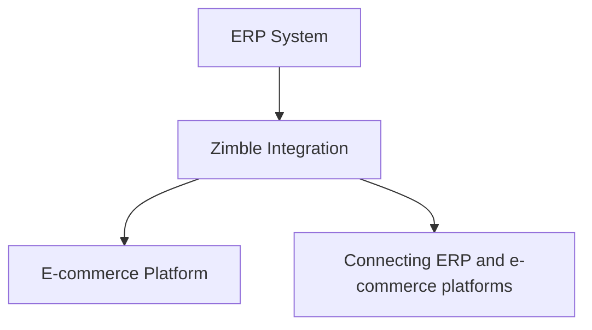
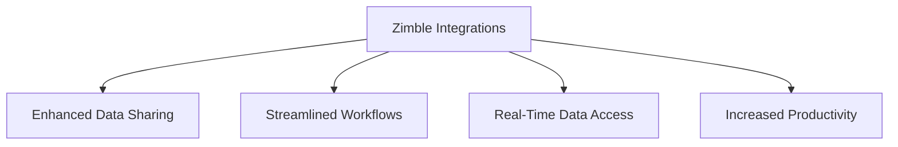

import { MainPasswordGuard } from "@site/src/components/PasswordGuard";

<MainPasswordGuard>

# 
Zimble Overview 

Zimble – The Trusted Integration Solution for Modern Businesses

Zimble is a powerful and reliable solution designed to help businesses seamlessly integrate and manage their e-commerce data across multiple platforms. In today’s highly competitive online marketplace, companies need to ensure that their systems are connected, efficient, and adaptable to ever-changing demands. Zimble addresses these needs by providing a robust integration layer that connects ERP systems with leading e-commerce platforms.

 

By enabling smooth communication between different platforms, Zimble eliminates data silos and ensures that critical business information flows seamlessly across systems. Whether it’s product catalogs, stock levels, orders, or customer information, Zimble guarantees accurate and real-time synchronization. This not only reduces manual effort and human errors but also supports informed decision-making by ensuring that stakeholders always have access to the latest data.

---

# 
Benefits Of Zimble Integration

The key advantages of Zimble Integrations includes:

**Enhanced Data Sharing:** 
Zimble Integrations facilitate smooth data sharing between the Zimble app and e-commerce platforms such as Apparel21, Lightspeed, Magento, Big Commerce, Shopify, and more. This ensures critical information is accessible, boosting efficiency and supporting informed decision-making.

**Streamlined Workflows:** 
Integrations connect the Zimble application with ERP and e-commerce systems, creating streamlined workflows. This reduces manual data entry and minimizes errors, saving time and effort.

**Real-Time Data Accessibility:** 
Integration allows seamless access to real-time data across interconnected applications. Users can schedule tasks like product and stock management and order processing through Zimble. Updates are automatically reflected in associated e-commerce platforms such as Shopify and Big Commerce.

**Increased Productivity:** 
Zimble Integrations enable users to operate within their familiar application environment while leveraging other software's capabilities, enhancing productivity without the need to switch between multiple platforms.

---

### 
Core Functionalities 

### 1. Scheduler (Jobs) : 
The "Job" feature creates tasks such as updating products, managing stock, importing orders, and handling media. Job types are dynamic, designed for future growth, and allow the platform to adapt to evolving business needs. 
We can manage jobs in two ways: recurring jobs and run-once jobs. Run-once jobs are set to run at a specified time and complete afterward. Recurring jobs run at defined intervals, such as every 5 minutes or every hour. 

**Job Status Management**
Every job has a clear and trackable status, making it easier for users to monitor 	execution. The predefined statuses include: 
- **Scheduled** – A job is queued and waiting for its defined start time.  
- **Running** – The job is currently being executed.  
- **Completed** – The job has finished successfully.  
- **Stopped** – The job was manually halted before completion.  
- **Paused** – The job execution is temporarily paused and can be resumed later.

These statuses improve transparency and allow users to identify issues quickly. 

## 2. Job Templates : 
To run a job, a command must define both the job type and the specific steps that the job will execute. This structured approach ensures consistency, automation, and repeatability across various tasks. The platform is designed to support dynamic job types, allowing it to adapt to a wide range of workflows without requiring custom code for each new scenario. This flexibility enhances both scalability and efficiency, making it easier to manage complex business processes.

For instance, consider an "Order Job" template. This job type may include a sequence of predefined steps such as:

- **Fetching new orders** from an external sales channel or internal database.
- **Validating** the order data for completeness and accuracy.
- **Transforming or mapping** the data into a format required by downstream systems.
- **Sending** the order information to Apparel21, a retail ERP system, via API or file-based integration.

By using templates like these, businesses can automate routine processes, minimize errors, and respond quickly to changing operational requirements all without the need for manual intervention or complex reconfiguration.

## 3. Application Config :  
The Application Configuration module serves as a critical bridge between ERP systems and e-commerce platforms, facilitating smooth and automated data flow between them. Its primary role is to define how different systems communicate, ensuring that information such as product data, inventory levels, orders, and customer details is accurately synchronized across all platforms.

To set up an integration, the configuration process requires detailed and specific inputs for both the ERP and the e-commerce components. This includes connection credentials, API endpoints, authentication methods, data mapping rules, and scheduling preferences. The configuration must be tailored to the unique capabilities and data formats of each system involved.

**Supported ERP systems include:**

- **Apparel21** - Commonly used in fashion and retail industries.
- **SAP Business One(SAP B1)** – A powerful ERP system designed for small to mid-sized enterprises.
- **Retail Express** – A retail-focused solution for inventory and point-of-sale management.

**Supported e-commerce platforms include:** 
- **Shopify** – A popular cloud-based platform for online retail businesses.
- **BigCommerce** – An enterprise-grade e-commerce solution supporting both B2B and B2C models.

By enabling seamless integration between these systems, the Application Config ensures real-time synchronization of business-critical data. This eliminates the need for manual data entry, reduces the risk of errors, and provides a unified view of operations across sales and fulfillment channels. As a result, businesses can improve operational efficiency, enhance customer experience, and scale more effectively.

## 4. Product Attribute :
Product attributes define the key characteristics and metadata associated with each product, such as size, color, SKU, price, and category. These attributes are essential for ensuring accurate product representation across various platforms, including ERP systems and e-commerce stores.

Each connector—whether it's linked to an ERP like Apparel21 or SAP B1, or an e-commerce platform like Shopify or BigCommerce—may have its own set of required and optional attributes. Proper configuration of these attributes ensures that data is correctly mapped and synchronized between systems, supporting consistent product listings, streamlined inventory management, and seamless order processing.

A detailed breakdown of product attributes required for each connector is provided in the following document:

[🔗 Product Attributes Documentation](https://fishead-my.sharepoint.com/:w:/g/personal/swetha_s_zimble_io/EemevlTC__JIhPs6AUTpQ6YBS2RPfzNnAjFC05h-_VW7UA?e=weAikG)

## 5. Recipes :
Recipes, a secondary menu option under Connect, are categorized as follows:

- **Product Recipe:** Created by selecting a source and destination, with a mapping list provided by the development team based on client needs. Source attributes map to destination attributes, and users can input text, formulas, or HTML for transformations. 

- **Stock Recipe:** Similar to the Product Recipe, it maps warehouses from source to destination as per client requirements. 

- **Order Recipe:**  Created by selecting the destination on the left and source on the right, mapping shipping methods and taxes based on client preferences. 

- **Customer Recipes:**  Source attributes map to destination attributes, ensuring consistency of customer names. 

- **Price List:**  Not mandatory for each client, it checks for available price lists. 

## 6. Translators: 
The "Translator" functionality bridges the source and destination connectors, transforming data formats. For example, a product color named "White Pink" can be represented as "Pink" in the destination.

**Adding a Translator:** 

-To add a new translator,Click "ADD" in the top right corner.

-A pop-up titled "New" appears with sections for "SOURCE," "DESTINATION," and "GROUP."

-Specify the field to translate in the "SOURCE" section and the desired format in the "DESTINATION" section. Grouping helps manage related translators.

## 7. Data Sets: 
The Data Sets module allows users to create and edit data within customized tables, enhancing flexibility. Users can define columns and rows, and while data can currently be added manually, future capabilities may allow direct data import from files.

## 8. Media:
The Media functionality facilitates importing product images and swatches based on a predefined Media recipe.

**Configuring Media Source in Zimble:** 
Before importing images, configure the media source by adding platforms like Google Drive, One Drive, AWS (S3), or SFTP.

**Access Configuration:** 
Click "ADD" to start adding a new media source.

**Configuration Page:** 
After clicking "ADD," follow the prompts to set up the media source.

**Import Options:** 
Specify what to import, including:

- **"Product Images"**

- **"Swatches"**

- **"Videos"**

**Mapping Preferences:** 
Define mapping preferences for files and directories.

## 9. Data Exchange:
Zimble offers robust CSV import and export functionality, allowing seamless data management using CSV or XML formats.

- **Export:**

Select the data export option in the Zimble admin panel.
Choose the connector (CSV or XML) and entity type (e.g., product, order).
Select an existing CSV template or create a new one, incorporating attributes and validation rules.
Save the template for future use, and Zimble generates a downloadable CSV file.

- **Import:**

Select the data import option and either choose an existing template or create a new one.
Add validation rules and specify field types.
Configure the source location for data retrieval.

## 10. Locations:
The "Locations" functionality allows efficient management of warehouse locations, particularly during the "Warehouse Fetch Job."

**How it works:** 
The "Warehouse Fetch Job" retrieves data from the API to update warehouse location information automatically. If updates fail, users can manually add locations using the "Add Location" button.

## 11. Users: 
Users: 
The "Users" functionality manages application access based on roles. Users can be invited or added, with three distinct types:

- **Super Admin:** Full access to the application.

- **Standard User:** Limited access to specific functionalities.

- **Client User:** Restricted to Connects, Web Tools, and Admin Toolkit.

## 12. Roles:
Zimble features three user roles:

- **Super Admin:** Access to all options.

- **Client Admin:** Limited to specific connections and tools.

- **Standard User:** Access to basic connections and tools.

**General Permissions**

LIST: View options.

CREATE: Add records.

EDIT: Modify records.

DELETE: Remove records.

## 13. Rules Engine:
The rules engine addresses recurring data mismatches and enhances tax management. It combines requirements from multiple customers regarding order routing and actions.

**Functionality and Implementation:** 
A Magento-like rules engine will provide flexibility and scalability, allowing users to toggle rules in the admin UI.

## 14. Cloud Config:
The "Cloud Configuration" functionality streamlines the setup of client cloud services like OneDrive, Google Drive, AWS (S3), and SFTP. Users provide essential credentials for configuration, enabling seamless integration with the Media page for managing media assets. 

## 15. Product Page:
The product page where all products are updated. Once the product job is completed, you can find all the updated products here. Additionally, this product page offers a range of additional functionalities for effective product management. 

Product Options 

Table View 

Filter Button 

List box  

Pagination 

Expand product-cell      

Status toggle 

 **Product options:** 

 - **Refresh:** 

The "Refresh" option serves to update a single product's data. This function, also referred to as the single product functionality, enables the refreshing of specific product information. Instead of running the entire product job, this option allows for data modification or refreshing the product based on changes in the ERP system for that product. 

 - **Delete:** 

The "Delete" option is used to remove a product. This action permanently eliminates a product's data from the Zimble and Ecommerce system. 

 - **Lock:** 

The "Lock" option is utilized to secure a product from further modifications. When a product is locked, any changes made to it will be prevented until it's unlocked. 
These options provide greater control over individual product management and streamline the process by allowing specific actions to be taken without affecting the entire product set. 

  - **Table View:** 

The "Table View" is an intriguing functionality that facilitates the exploration of product variants based on specific attributes. The additional attributes that become available to add to the table data set are defined in the attribute config UI. With this feature, you can conveniently access details such as "original price," "retail price," "color," "size," "price," "code," "color label," and "season." These newly introduced attributes enrich the product specification display. 

When the "Table View" is activated, the attributes you've added become visible in a row format. This format offers a structured and easy-to-read presentation, allowing users to quickly access and compare the various attributes of different product variants. This feature enhances the efficiency of product analysis and enables users to make informed decisions based on the displayed attributes. 
 Filter Button: 

The **"Filter"** option acts like a search tool, helping us quickly find products. It works by using attributes like product name, SKU, and code. This makes identifying products much easier. You'll find this helpful filter on various pages in Zimble, such as the product, order, and stock pages, as well as on the product attribute pages within the application configuration. This makes searching and locating products a breeze across different parts of the application. 
List box: 

The **"List box"** functionality gathers product data into a single page. By clicking on the list box, users can select the amount of product data they want to view on the page. They can choose from options like (10, 25, 50, or 100), depending on their specific needs and preferences. This feature streamlines the viewing experience by allowing users to control the quantity of product data they interact with at once. 

 - **Pagination:** 

This functionality is used to navigate from one page to another page. 

 - **Expand product-Cell:** 

This functionality allows you to expand the product's details. When you expand the product cell, you can access its variants, such as size and color, along with other attributes. These attributes are the ones you've added to the table view table for easy reference. 

 - **Status Toggle:** 

The status toggle is a tool that changes the product's availability on the Zimble product page. If you turn off the toggle, the product will be deactivated on both Zimble and the linked e-commerce platform 

“If the connector is Shopify, the product will be updated to draft status. If it is BC, the product will be made invisible in the BC admin”. 

## 16. Stock Page:

- **Connector Name:** 

 On the stock page, you can see the connector name associated with the stock information. If you click on the connector, it will show you a list of warehouses along with the stock counts for each product and its variants. This provides an overview of how much stock is available across different locations.

- **Multiple stores:** 

If you have multiple stores within a single client, such as AU, US, and INT stores, and you want to view the stock data for a specific store like US or AU, you can easily do so. Just click on the name of the store, for instance, "BC-AU." Clicking on this store's name will display the stock data exclusively for that specific store. This way, you can quickly access the stock information you need for a particular location.

- **Warehouse information:**  

These warehouse names represent various locations where stock is stored. They display the stock levels associated with different stores connected to this client. Each warehouse is linked to a specific store, allowing you to see the stock levels for different stores within the client.

- **Stock single refresh:**  

This is a singular stock refresh functionality that's specifically designed to update the stock for an individual product. When you use this stock refresh feature, it works similarly to the single product refresh functionality. In this case, you're refreshing the stock data for a single product instead of the entire stock inventory. 
## 17. Order Page:
The orders page in Zimble is where you can find and manage updated orders. These orders are coming from external platforms like BigCommerce, Shopify, and others. They originate from customer purchases in the front-end store. This page allows you to view, organize, and handle these orders efficiently within the Zimble. 

---

# Overview Order Page Options 

The Orders Page within our application offers a range of essential options to manage and monitor orders efficiently. This section provides a comprehensive overview of these options, empowering users to navigate through orders seamlessly. 

**Filter option:**

The filter options are used to locate specific orders or modify their order status, such as "synced," "sync error," and "Waiting for sync." When we activate the filter option, fields like status, order number, customer name, email, mobile, etc., are highlighted. These fields help us locate a particular order on the order page. However, the most commonly used field for finding orders on this page is the "Order Number." 
There are several filter options available, including "SYNCED," "SYNC ERROR," and "WAITING FOR SYNC." These options are found on the status page and allow us to filter orders based on their status. 

**SYNCED:** Orders of this type have been successfully synchronised in Zimble. These orders originate from platforms like Shopify or Big-commerce and are imported into Zimble. When synchronization is successful, these orders are updated in the corresponding ERP system. 

**SYNC ERROR:** If an order fails to synchronize in Zimble for any reason, it appears on the orders page under the "SYNC ERROR" option. This allows us to identify orders that haven't been successfully synchronized. 

**WAITING FOR SYNC:** Orders that have not been updated in Zimble require manual intervention. These orders can be manually imported using the "manual import" option, along with the order ID. This action assigns the "Waiting for sync" status to these orders. 

**Options:**

**Upon clicking the options button, two choices become visible:** MANUAL IMPORT and ORDER COMPARE. 

**MANUAL IMPORT:** This option serves the purpose of manually importing orders that have not been updated on the order page despite the completion of the order import process. In such cases, these orders need to be imported manually using their respective order ID’s. 

To initiate a manual import, click on the "Manual Import" option. A pop-up titled "Order Import" will appear. In this pop-up, you will need to select the appropriate Connector Type, indicating whether the order originates from Shopify or Big-Commerce 

**Order Compare:** In cases where a few orders have not been successfully transferred to Zimble, a solution is to run the "Order Compare" job. This job helps identify and retrieve the missing orders, making them visible on the "Order Compare" page. 
 
This functionality is akin to the order page. If you're looking to view the orders that are missing, you can achieve this by applying a filter. Click on the filter option and select the "MISSING" filter. By doing so, you will access a list of the missing orders. Collect the order IDs from this list, and then use the manual import functionality to bring these orders into Zimble 

Overview of Bulk Operations (Re-Import, Sync Again, Bulk Delete) on the Order Page 

**Re-Import:**

Fundamentally, the 'Re-Import' operation is utilized exclusively for orders. In certain situations, an order might fail to synchronize with Zimble due to various reasons. In such cases, we employ the 're-import' option. This option allows us to re-import the order and subsequently synchronize it with Zimble. 

Now, the 'Bulk Re-Import' option serves the purpose of re-importing multiple orders that have encountered synchronization errors into Zimble. When we execute this action on the orders, several of them might successfully synchronize without necessitating the 'Sync Again' operation. 

**Sync-Again:** 

In situations where a few orders encounter Sync errors, we utilize the 'Sync-Again' option to sync those orders with Zimble. This approach enables us to effectively resolve Sync issues and ensure the proper functioning of the functionality. 

Furthermore, the 'Bulk Sync-Again' functionality serves the purpose of re-syncing multiple orders simultaneously with a single click. This smooth feature simplifies the process of rectifying synchronization problems across multiple orders. 

**Bulk Delete:**

If we come across unnecessary orders in Zimble or encounter cases where orders need to be deleted, we make use of the delete functionality. 

The 'Bulk delete' functionality is employed to delete multiple orders simultaneously, streamlining the process of removing multiple orders at once. 

**(NOTE: - The functionalities mentioned above (Re-Import, Sync-Again, Delete) are also accessible inside the order page.)**

</MainPasswordGuard>

